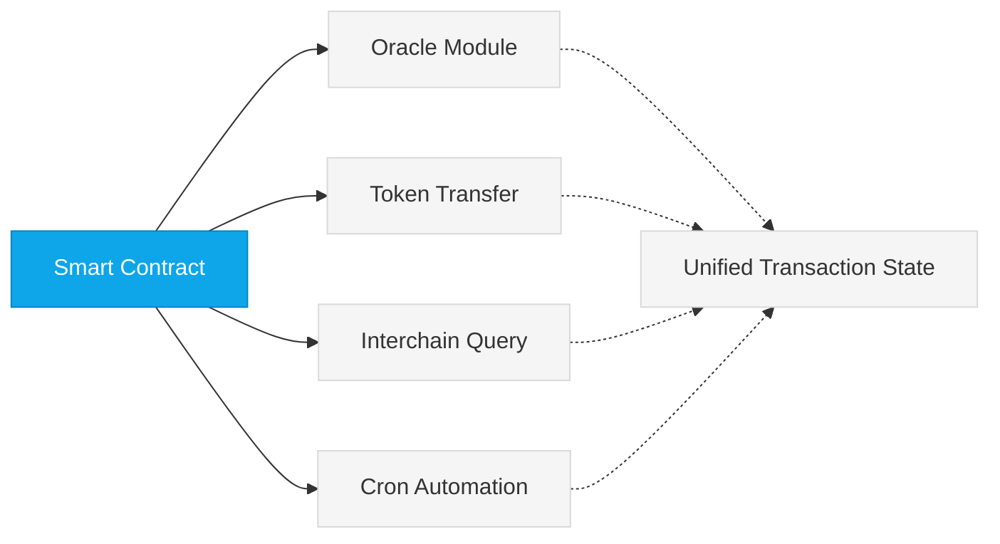

Neutron implements an integrated blockchain architecture that combines critical DeFi infrastructure directly at the protocol layer. This design ensures guaranteed execution, native cross-chain communication, atomic composability, and predictable performance—creating a shared environment where DeFi protocols benefit from specialized infrastructure without sacrificing interoperability.

## Core Infrastructure Components

<CardGroup cols={2}>
  <Card title="Oracle Module" icon="bolt" iconType="duotone" href="/developers/modules/oracle">
    Native price feeds updated every block with hardware-based security, eliminating dependence on external oracles and providing superior execution guarantees.
  </Card>
  <Card title="Interchain Queries (ICQ)" icon="network-wired" iconType="duotone" href="/developers/modules/interchain-queries">
    Direct state queries across any IBC-connected chain, enabling real-time cross-chain data access without trusted third parties.
  </Card>
  <Card title="Cron Module" icon="clock" iconType="duotone" href="/developers/modules/cron">
    Native automation allowing scheduled and conditional contract execution with protocol-level reliability.
  </Card>
  <Card title="Interchain Accounts" icon="arrows-left-right" iconType="duotone" href="/developers/tutorials/cosmwasm_ica">
    Built-in interchain account functionality enabling seamless cross-chain operations with consensus-enforced security.
  </Card>
</CardGroup>

## Benefits of Integration

<CardGroup cols={2}>
  <Card title="Capital Efficiency" icon="coins" iconType="duotone">
    <ul className="mt-2 space-y-1">
      <li>Optimized liquidity utilization across protocols</li>
      <li>Reduced capital requirements through composability</li>
    </ul>
  </Card>
  
  <Card title="Reliability" icon="shield-check" iconType="duotone">
    <ul className="mt-2 space-y-1">
      <li>Infrastructure failures are consensus failures</li>
      <li>Guaranteed execution within block boundaries</li>
    </ul>
  </Card>
  
  <Card title="Performance" icon="bolt" iconType="duotone">
    <ul className="mt-2 space-y-1">
      <li>Direct state access without contract calls</li>
      <li>High-frequency oracle updates every block</li>
    </ul>
  </Card>
  
  <Card title="Security" icon="lock" iconType="duotone">
    <ul className="mt-2 space-y-1">
      <li>Protocol-level validation of all operations</li>
      <li>No trusted external oracles or bridges</li>
    </ul>
  </Card>
</CardGroup>

## Atomic Composability

Neutron enables true atomic composability across all protocol features within a single transaction:

All operations execute atomically in a single transaction context, providing developers with strong guarantees while eliminating interoperability risks.

## Real-World Applications

### Supervaults
Supervaults represent a new approach to liquidity provision that overcomes the limitations of traditional AMMs. By leveraging Neutron's built-in high-frequency oracle and native automation features, Supervaults can:

- Market make at the most recent CEX prices
- Automatically rebalance every block
- Perform arbitrage themselves instead of being arbitraged
- Democratize profits to liquidity providers

### Cross-Chain Liquid Staking
Protocols can utilize Neutron's Interchain Accounts and Interchain Queries (ICQ) capabilities to:

- Read the state of other blockchains
- Adjust delegations made by remotely controlled accounts
- Onboard new assets from connected chains with a single transaction
- Provide users with a seamless cross-chain staking experiences
