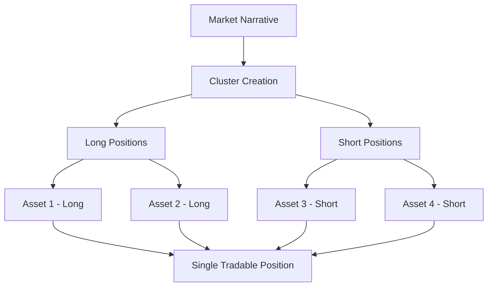

## Strategic Trading with Bull vs. Bear

Bull vs. Bear is Neutron's innovative trading platform that enables users to create and execute sophisticated long-short strategies through narrative-based Clusters. It provides a powerful way to gain targeted exposure to specific market narratives without managing multiple individual positions.

## What are Clusters?

  Clusters are strategic groupings of multiple long and short positions packaged into a single tradable unit. This allows traders to express directional views on broader market narratives or trends, rather than individual assets.

## Key Features

**Narrative-Based Trading**: Express views on market narratives like "BTC Dominance," "Ethereum L2 Growth," or "AI Tokens" through unified positions.

**Long-Short Combinations**: Gain exposure to relative price movements by simultaneously going long on certain assets and short on others.

**Pre-Made Clusters**: Choose from professionally designed Clusters or create your own custom combinations to match your market thesis.

**Customizable Weights**: Adjust the weighting of individual assets within a Cluster to fine-tune your exposure and risk profile.

## How Clusters Work

Clusters allow you to express complex market views through unified positions:

For example, if you believe in Bitcoin dominance increasing:
1. Create a Cluster that goes long on Bitcoin
2. Add short positions on altcoins you expect to underperform
3. Set your preferred weights for each position
4. Trade the entire Cluster as a single unit

## Example Clusters

  

    <h3 className="text-xl font-semibold mb-2">BTC vs Blue Chips</h3>
    

      

        BTC (Long)
        50%
      

      

        

      

    

    

      

        ETH (Short)
        25%
      

      

        

      

    

    

      

        SOL (Short)
        25%
      

      

        

      

    

    
This Cluster expresses a bullish view on Bitcoin's dominance relative to leading altcoins.

  

  
  

    <h3 className="text-xl font-semibold mb-2">Ethereum L2's</h3>
    

      

        ZK (Long)
        33%
      

      

        

      

    

    

      

        OP (Long)
        33%
      

      

        

      

    

    

      

        ARB (Long)
        34%
      

      

        

      

    

    
This Cluster expresses a bullish view on the Ethereum Layer 2 ecosystem.

  

  
  

    <h3 className="text-xl font-semibold mb-2">Dynamic Funding Strategy</h3>
    

      

        BERA (Long)
        25%
      

      

        

      

    

    

      

        Trump (Long)
        25%
      

      

        

      

    

    

      

        OSMO (Short)
        25%
      

      

        

      

    

    

      

        TIA (Short)
        25%
      

      

        

      

    

    
This Cluster capitalizes on funding rate differentials across various assets.

  

## Benefits of Cluster Trading

  <strong>Key advantages:</strong>
  <ul className="mt-2">
    <li><strong>Narrative Exposure:</strong> Gain exposure to thematic market movements rather than individual assets</li>
    <li><strong>Simplified Management:</strong> Manage multiple positions through a single interface</li>
    <li><strong>Reduced Transaction Costs:</strong> Execute complex strategies with fewer individual trades</li>
    <li><strong>Balanced Risk:</strong> Diversify within a theme while maintaining directional exposure</li>
    <li><strong>Capital Efficiency:</strong> Deploy capital across multiple positions with a single transaction</li>
  </ul>

## Creating and Using Clusters

**Define Narrative**: Identify the market trend or thesis you want to express → **Select Assets**: Choose which assets to go long and short → **Set Weights**: Determine capital allocation for each position → **Deploy Capital**: Execute your strategy with a single transaction and monitor performance

### Use Cases

**Sector Rotation**: Create Clusters that express views on one sector outperforming another, such as DeFi vs CeFi or NFTs vs Gaming.

**Market Hedging**: Establish hedge positions against your existing portfolio by creating inverse Clusters to specific market segments.

**Trend Following**: Capitalize on emerging market narratives by creating Clusters aligned with developing trends.

## Get Started with Bull vs. Bear

**Explore Clusters**: Browse pre-made Clusters or create your own on the [Neutron app](https://app.neutron.org)

**Trading Dashboard**: Monitor and manage your active Clusters through the platform interface

**Community**: Discuss trading strategies with other Cluster traders in the [Neutron Community Telegram](https://t.me/neutronzone)

  <strong>Coming Soon:</strong> Enhanced Cluster analytics, automated rebalancing, and additional asset types for even more sophisticated narrative-based trading strategies.

 
