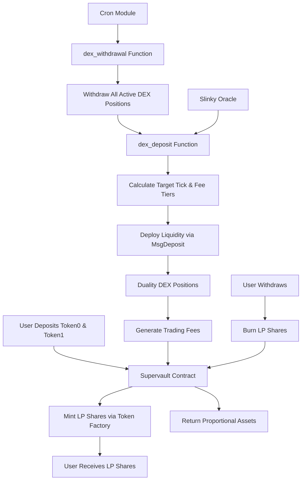

Supervaults (mmvault contracts) are Neutron's flagship DeFi innovation that manage liquidity on behalf of users by efficiently allocating deposits into the Neutron DEX (Duality). Using Neutron's integrated infrastructure, they automatically rebalance positions across different price ranges and fee tiers, achieving maximal capital efficiency and improving outcomes for both traders and liquidity providers.

The vault contract abstracts away direct DEX interactions from end users, allowing users to interact through standardized deposit and withdrawal flows while the vault autonomously manages liquidity provisioning via Cron-triggered rebalancing logic.

Unlike traditional yield vaults or static liquidity pools, Supervaults actively optimize capital deployment to:

- Minimize slippage for traders through concentrated liquidity
- Maximize fees earned by liquidity providers across multiple fee tiers
- Reduce impermanent loss through dynamic position management and rebalancing

<CardGroup cols={2}>
  <Card title="For Liquidity Providers" icon="coins" iconType="duotone">
    Deposit paired tokens and receive LP share tokens representing proportional vault ownership. Earn optimized yields through strategic liquidity placement across price ranges and fee tiers.
  </Card>
  
  <Card title="For Traders" icon="chart-line" iconType="duotone">
    Supervaults provide deeper liquidity at current price points, resulting in significantly reduced slippage for large trades and better execution quality.
  </Card>
</CardGroup>

## How Supervaults Work

Supervaults integrate with Neutron's core modules to enable continuous, trustless operation:

### User Flows

<CardGroup cols={2}>
  <Card title="Deposit Process" icon="wallet" iconType="duotone">
    Users deposit paired tokens (token0 and token1) and receive LP shares minted via Neutron's token factory module, representing their proportional claim on the vault's total value.
  </Card>
  
  <Card title="Withdrawal Process" icon="money-bill-transfer" iconType="duotone">
    Users redeem LP shares to withdraw their proportional share of vault assets. The vault handles complex DEX position management automatically during withdrawals.
  </Card>
</CardGroup>

### Automated Rebalancing with Cron and Slinky Oracle

<CardGroup cols={3}>
  <Card title="Slinky Oracle Integration" icon="globe" iconType="duotone">
    Supervaults leverage Neutron's Slinky price oracle to fetch fresh price data for precise rebalancing calculations and liquidity positioning.
  </Card>
  
  <Card title="Two-Phase Rebalancing" icon="clock" iconType="duotone">
    The Cron module triggers a two-phase rebalancing process each block: first withdrawing all active positions, then redeploying liquidity based on current market conditions.
  </Card>
  
  <Card title="Multi-Tier Deployment" icon="layer-group" iconType="duotone">
    Liquidity is strategically deployed across different price ranges and fee tiers, optimizing for both capital efficiency and fee generation.
  </Card>
</CardGroup>

### Technical Architecture

The complete rebalancing flow works as follows:

1. **dex_withdrawal()**: Each block, Cron first triggers withdrawal of all active DEX positions owned by the vault
2. **dex_deposit()**: Immediately after, it fetches fresh prices from Slinky oracle and recomputes optimal liquidity deployment
3. **Strategic Positioning**: Based on fee tier allocation, token imbalance, and configured parameters, liquidity is deployed across multiple price ranges
4. **Full Custody**: The vault maintains complete custody of all funds throughout the process

## Capital Efficiency Advantages

Supervaults achieve exceptional capital efficiency through several mechanisms:

<CardGroup cols={2}>
  <Card title="Concentrated Liquidity Management" icon="layer-group" iconType="duotone">
    Unlike passive AMMs, Supervaults actively concentrate liquidity around current market prices across multiple fee tiers, maximizing capital utilization.
  </Card>
  
  <Card title="Automated Fee Tier Optimization" icon="chart-pie" iconType="duotone">
    The vault automatically allocates liquidity across different fee tiers based on market conditions, optimizing for both volume and fee generation.
  </Card>
  
  <Card title="Dynamic Rebalancing" icon="arrow-trend-up" iconType="duotone">
    Continuous rebalancing ensures liquidity stays optimally positioned as market conditions change, without requiring manual intervention.
  </Card>
  
  <Card title="Proportional Share System" icon="database" iconType="duotone">
    The token factory-based LP share system ensures fair distribution of rewards and accurate tracking of user ownership through all rebalancing operations.
  </Card>
</CardGroup>

## Comparison to Traditional Approaches

  <table className="min-w-full border border-gray-300 dark:border-gray-700">
    <thead>
      <tr className="bg-gray-100 dark:bg-gray-800">
        <th className="p-3 text-left">Feature</th>
        <th className="p-3 text-left">Standard AMM (e.g., Uniswap v2)</th>
        <th className="p-3 text-left">Concentrated Liquidity (e.g., Uniswap v3)</th>
        <th className="p-3 text-left">Neutron Supervaults</th>
      </tr>
    </thead>
    <tbody>
      <tr className="border-t border-gray-300 dark:border-gray-700">
        <td className="p-3 font-medium">Liquidity Positioning</td>
        <td className="p-3">Passive, across infinite price range</td>
        <td className="p-3">Manual selection of price ranges</td>
        <td className="p-3">Automated dynamic positioning across multiple ranges</td>
      </tr>
      <tr className="border-t border-gray-300 dark:border-gray-700 bg-gray-50 dark:bg-gray-900">
        <td className="p-3 font-medium">Fee Tier Management</td>
        <td className="p-3">Single fee tier</td>
        <td className="p-3">Manual fee tier selection</td>
        <td className="p-3">Automated allocation across multiple fee tiers</td>
      </tr>
      <tr className="border-t border-gray-300 dark:border-gray-700">
        <td className="p-3 font-medium">Rebalancing</td>
        <td className="p-3">None needed</td>
        <td className="p-3">Manual or via third-party services</td>
        <td className="p-3">Automated via Cron module every block</td>
      </tr>
      <tr className="border-t border-gray-300 dark:border-gray-700 bg-gray-50 dark:bg-gray-900">
        <td className="p-3 font-medium">LP Experience</td>
        <td className="p-3">Simple but inefficient</td>
        <td className="p-3">Complex, requires active monitoring</td>
        <td className="p-3">Simple deposit with automated optimization</td>
      </tr>
      <tr className="border-t border-gray-300 dark:border-gray-700">
        <td className="p-3 font-medium">Oracle Integration</td>
        <td className="p-3">None</td>
        <td className="p-3">Third-party (if any)</td>
        <td className="p-3">Native Slinky oracle integration</td>
      </tr>
      <tr className="border-t border-gray-300 dark:border-gray-700 bg-gray-50 dark:bg-gray-900">
        <td className="p-3 font-medium">Share Tracking</td>
        <td className="p-3">ERC-20 LP tokens</td>
        <td className="p-3">NFT positions</td>
        <td className="p-3">Token factory LP shares with proportional rewards</td>
      </tr>
    </tbody>
  </table>

## Get Started with Supervaults

<CardGroup cols={3}>
  <Card title="Deposit Assets" icon="wallet" iconType="duotone">
    Provide paired token liquidity to earn optimized yields with fully automated management
  </Card>
  
  <Card title="View Analytics" icon="chart-column" iconType="duotone">
    Monitor performance metrics, yield statistics, and rebalancing activity
  </Card>
  
  <Card title="Trade with Low Slippage" icon="bolt" iconType="duotone">
    Execute large trades with minimal price impact thanks to concentrated liquidity
  </Card>
</CardGroup>

  <strong>Technical Implementation:</strong> Supervaults represent the cutting edge of automated market making, combining Neutron's integrated modules (Cron, Slinky Oracle, Token Factory, and Duality DEX) into a unified liquidity management system that operates trustlessly without external dependencies.

 