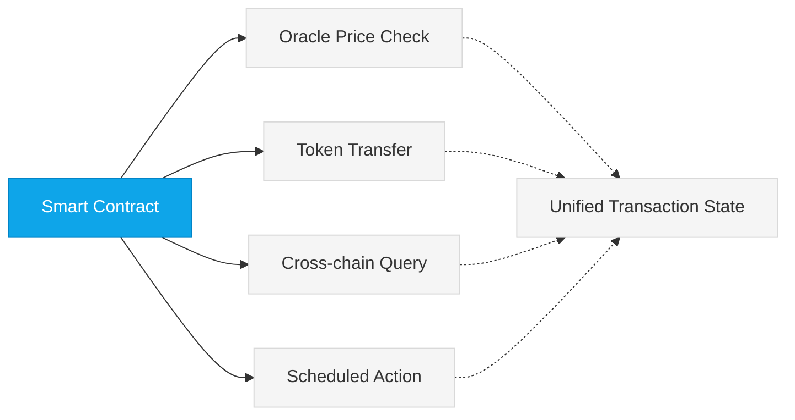
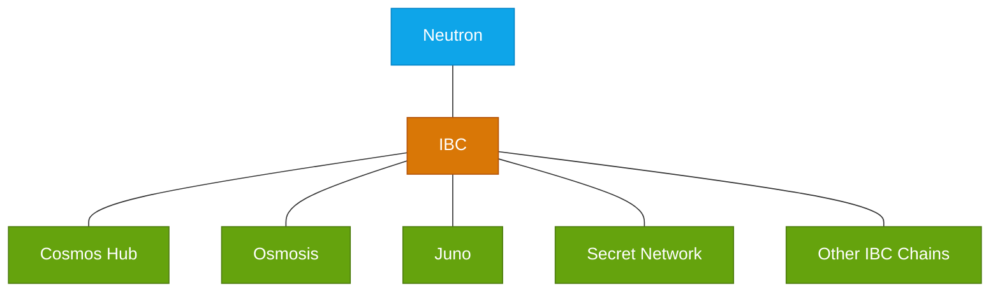

# Neutron Architecture

Neutron is built using the Cosmos SDK and implements a module-based architecture that provides native support for DeFi operations across blockchains. This page explains the key architectural components that developers should understand when building on Neutron.

## Core Architecture

<CardGroup cols={2}>
  <Card title="CosmWasm Integration" icon="file-code">
    Smart contract runtime environment based on WebAssembly, allowing contracts written in Rust to be deployed on-chain.
  </Card>
  
  <Card title="Cosmos SDK Modules" icon="cubes">
    Modular components providing specialized functionality like IBC connections, token transfers, and governance.
  </Card>
  
  <Card title="Interchain Support" icon="network-wired">
    Cross-chain communication through IBC protocol, with unique features for queries and account control.
  </Card>
  
  <Card title="CometBFT Consensus" icon="link">
    Underlying consensus mechanism providing BFT consensus with fast finality and transaction ordering.
  </Card>
</CardGroup>

## Key Architectural Features

Neutron differentiates itself from other Cosmos chains by integrating critical DeFi infrastructure directly at the protocol layer:

### Atomic Composability

All operations within a Neutron transaction execute atomically, maintaining a unified transaction state:



Atomicity ensures that cross-contract calls, external API interactions, and module operations either all succeed or all fail together.

### Module Architecture

Neutron consists of a collection of specialized modules that work together to provide its unique functionality:

<CardGroup cols={3}>
  <Card title="Interchain Queries" icon="database" href="/developers/modules/interchain-queries/overview">
    Query state from remote chains directly.
  </Card>
  
  <Card title="Interchain Accounts" icon="user-shield" href="/developers/modules/interchaintxs/overview">
    Control accounts on remote chains from Neutron.
  </Card>
  
  <Card title="Cron" icon="clock" href="/developers/modules/cron/overview">
    Schedule reliable function execution.
  </Card>
  
  <Card title="Oracle" icon="satellite-dish" href="/developers/modules/oracle/overview">
    Get trustworthy price data in every block.
  </Card>
  
  <Card title="DEX" icon="arrow-right-arrow-left" href="/developers/modules/dex/overview">
    Execute trades with hybrid orderbook/AMM model.
  </Card>
  
  <Card title="Contract Manager" icon="shield-check" href="/developers/modules/contractmanager/overview">
    Safely handle IBC acknowledgments.
  </Card>
</CardGroup>

## Technical Implementation

### Smart Contract Integration

Neutron uses CosmWasm to execute WebAssembly-based smart contracts. This architecture allows contracts to:

1. Message other contracts atomically
2. Call into any of Neutron's custom modules
3. Initiate interchain operations to other blockchains
4. Schedule actions for future execution

```rust
// Example: Smart contract integrating with various Neutron modules
pub fn execute(
    deps: DepsMut,
    env: Env,
    info: MessageInfo,
    msg: ExecuteMsg,
) -> Result<Response, ContractError> {
    match msg {
        // Call into Oracle module to get price data
        ExecuteMsg::GetPrice { denom } => {
            let oracle_query = QueryRequest::Custom(NeutronQuery::OraclePrice { denom });
            let price: PriceResponse = deps.querier.query(&oracle_query)?;
            
            // Use price data...
            Ok(Response::new().add_attribute("price", price.price.to_string()))
        },
        
        // Register an interchain query
        ExecuteMsg::QueryRemoteChain { connection_id, remote_address } => {
            let icq_msg = NeutronMsg::RegisterInterchainQuery {
                query_type: QueryType::KV {
                    connection_id,
                    keys: vec![Key {
                        path: format!("bank/balances/{}", remote_address),
                        key: Binary::from(b""),
                    }],
                },
                transactions_filter: TransactionsFilterType::None,
                update_period: 10,
            };
            
            Ok(Response::new()
                .add_message(icq_msg)
                .add_attribute("action", "register_icq"))
        },
        
        // Schedule a future action
        ExecuteMsg::ScheduleRebalance { time } => {
            let cron_msg = NeutronMsg::CreateCronTask {
                task: CronTask {
                    name: "rebalance".to_string(),
                    period: time.to_string(),
                    msgs: vec![WasmMsg::Execute {
                        contract_addr: env.contract.address.to_string(),
                        msg: to_binary(&ExecuteMsg::Rebalance {})?,
                        funds: vec![],
                    }
                    .into()],
                },
            };
            
            Ok(Response::new()
                .add_message(cron_msg)
                .add_attribute("action", "schedule_rebalance"))
        },
        
        // Other message handlers...
        _ => Err(ContractError::InvalidMessage {}),
    }
}
```

### Module Interaction Flow

When building on Neutron, your contracts typically interact with the blockchain's architecture in this pattern:

1. **Contract Initialization**: Set up your contract state and configurations
2. **External Module Integration**: Register interchain queries, schedule tasks, etc.
3. **State Management**: Handle state changes based on messages and queries
4. **Event Emission**: Broadcast events for indexers and subscribers
5. **Response Handling**: Manage success/failure cases and state transitions

## Module System Architecture

Neutron extends the Cosmos SDK module system with specialized modules for DeFi applications:

```
neutron/
├── app/                # Core application components
├── types/              # Common type definitions
└── x/                  # Custom Neutron modules
    ├── interchainqueries/  # Interchain query module
    ├── interchaintxs/      # Interchain transaction module
    ├── cron/               # Automated task scheduling
    ├── dex/                # Decentralized exchange module
    ├── contractmanager/    # Smart contract management
    ├── oracle/             # Price oracle system
    ├── feeburner/          # Fee burning mechanism
    └── feerefunder/        # Fee refund for IBC operations
```

## Network Architecture

Neutron's network architecture is based on a hub-and-spoke model, where Neutron acts as a specialized DeFi hub connected to other chains through IBC:



## Developer Resources

<CardGroup cols={2}>
  <Card title="Cosmopark Development Environment" icon="server" href="/developers/tutorials/onboarding/cosmopark">
    Set up a complete local development environment with interconnected Neutron and Cosmos Hub nodes.
  </Card>
  
  <Card title="Contract Examples" icon="code" href="https://github.com/neutron-org/neutron-sdk/tree/main/contracts/neutron_interchain_queries">
    Reference implementations showing how to use Neutron's unique features.
  </Card>
  
  <Card title="Neutron SDK" icon="box" href="https://github.com/neutron-org/neutron-sdk">
    Libraries and helpers for building applications on Neutron.
  </Card>
  
  <Card title="Module Documentation" icon="book" href="/developers/modules/overview">
    Detailed technical specifications for each Neutron module.
  </Card>
</CardGroup>

## Architectural Best Practices

When building on Neutron, consider these architectural best practices:

1. **Leverage Native Modules**: Use Neutron's built-in modules for oracle data, automation, and cross-chain operations instead of implementing these yourself.

2. **Design for Composability**: Structure your contracts to be easily composed with other DeFi protocols on Neutron.

3. **Optimize Gas Usage**: Be mindful of gas costs, especially when utilizing interchain features that may involve multiple transactions.

4. **Handle Asynchronous Operations**: Many interchain operations are asynchronous; design your contract architecture to handle callbacks and timeouts gracefully.

5. **Implement Security Checks**: Always validate input data, especially from external sources like interchain queries.

<div className="p-4 border-l-4 border-primary bg-primary/5 rounded my-6">
  <strong>Developer Tip:</strong> Neutron's architecture is optimized for cross-chain DeFi applications. When designing your application, think about which chains you need to interact with and which Neutron modules best support those interactions.
</div> 