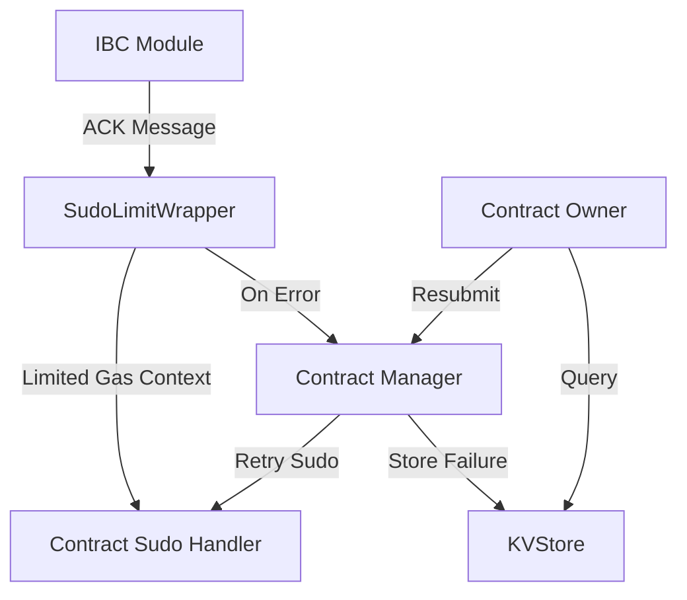
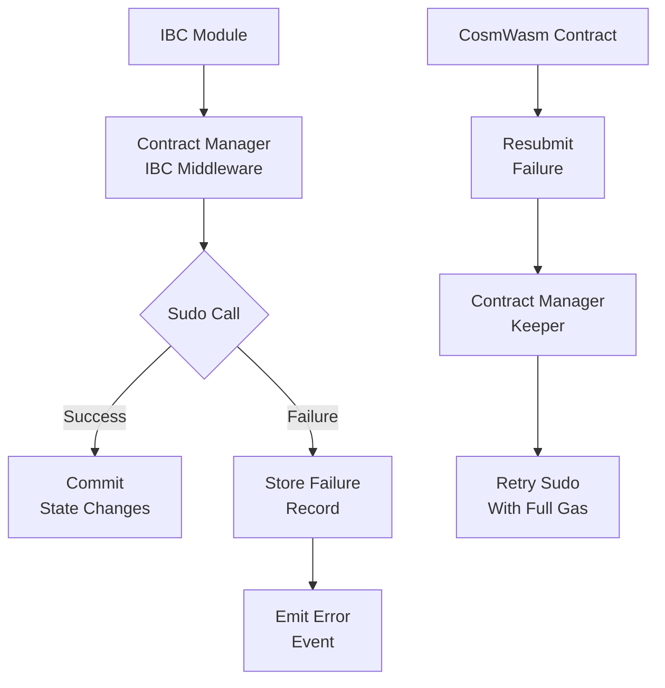

The Contract Manager module implements a crucial safety mechanism for IBC-enabled smart contracts. This document explains the principles, architecture, and internal mechanisms of the module.

## Core Concepts

### The Sudo Handler Challenge

When smart contracts interact with IBC, they must handle acknowledgments from counterparty chains. These acknowledgments are delivered to contracts via sudo calls, which are privileged operations that bypass normal permission checks. This creates several potential issues:

1. **IBC Channel Disruption**: If a contract's sudo handler fails when processing an acknowledgment on an ORDERED channel, it can disrupt the entire channel.

2. **Relayer Load**: Even on UNORDERED channels, a failing sudo handler can force relayers to repeatedly attempt delivery, causing unnecessary load.

3. **Attack Vector**: Malicious contracts could deliberately implement failing sudo handlers to attack the network infrastructure.

### The Solution

To address these challenges, the Contract Manager module implements a pattern where:

1. Sudo calls are executed in a temporary context (CacheContext), isolating any state changes.
2. If the sudo call succeeds, the state changes are committed.
3. If the sudo call fails, the error is captured and stored rather than propagated, allowing the IBC workflow to continue.
4. Contract owners can later query these stored failures and handle them appropriately.

## Architecture



### SudoLimitWrapper

The SudoLimitWrapper is a middleware that intercepts calls to the Wasm module's Sudo method. It:

1. **Enforces Gas Limits**: Prevents contracts from using excessive gas during sudo calls.
2. **Captures Errors**: Intercepts both explicit errors and out-of-gas panics from sudo handlers.
3. **Records Failures**: Stores sudo call failures for later retrieval and potential resubmission.

The wrapper implements the `WasmKeeper` interface:

```go
type WasmKeeper interface {
    HasContractInfo(ctx sdk.Context, contractAddress sdk.AccAddress) bool
    Sudo(ctx sdk.Context, contractAddress sdk.AccAddress, msg []byte) ([]byte, error)
}
```

## Gas Limitation Mechanism

To prevent DoS attacks via recursive IBC messages that could deplete block gas, the module enforces a strict gas limit for sudo calls. This limit is defined by the `SudoCallGasLimit` parameter.

The gas limitation has important implications:

1. Complex operations shouldn't be performed directly in sudo handlers since they may exceed the gas limit.
2. As a best practice, sudo handlers should store the received data in the contract's state and defer processing to a later explicit execution.
3. If a contract exceeds the gas limit, the operation is terminated, and a failure record is created.

## Failure Management

### Failure Record Structure

When a sudo call fails, the module stores a `Failure` record with:

- **Address**: The contract address that experienced the failure
- **ID**: A sequential identifier for failures of the specific contract
- **SudoPayload**: The serialized data that was sent to the sudo handler
- **Error**: A redacted version of the error for deterministic storage

### Error Redaction

Since raw error messages may not be deterministic across nodes, the module redacts errors stored in the state to contain only the codespace and code ID. The full error text is emitted as an event rather than stored in state.

## Failure Resubmission

Contracts can resubmit their failures for processing outside the relayer context. This feature allows:

1. Contracts to retry processing of a failed sudo call with more gas available.
2. Developers to fix contract bugs and then process previously failed acknowledgments.

The resubmission is permissioned - only the contract that originally received the IBC message can resubmit its failures.

## State Consistency

To protect chain state, all sudo calls are executed in a temporary context (CacheContext):

1. A temporary context is created before executing the sudo call.
2. If the sudo call succeeds, changes are written to the active state.
3. If the sudo call fails, the context is discarded, and no changes are made to the state.

This ensures that even if a contract's sudo handler partially executes before failing, no state changes are committed.

## Module Architecture Diagram



This architecture ensures robust handling of IBC acknowledgments while protecting the network from potentially harmful contract behavior. 