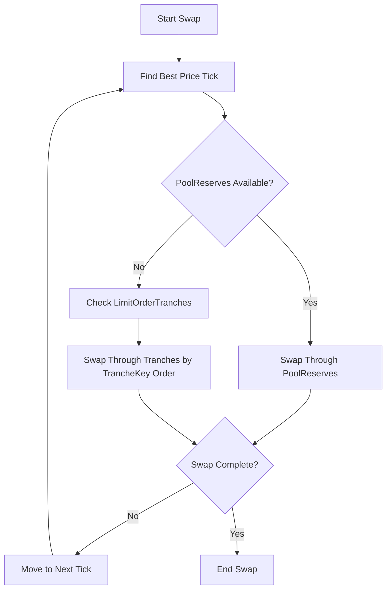

Swaps are the core trading mechanism in the Neutron DEX, enabling users to exchange tokens at precise prices with minimal slippage. The system supports both single-hop and multi-hop swaps for optimal price discovery.

## Swap Execution Process

## Single-Hop Swaps

Single-hop swaps exchange tokens directly between two assets using available liquidity at various price points.

### Execution Steps

1. **Price Discovery**: Find the best available price (lowest tick for buying, highest tick for selling)
2. **Liquidity Consumption**: Consume available liquidity in order of priority
3. **Fee Deduction**: Apply appropriate fees based on the tick's fee tier
4. **State Update**: Update reserves and user balances

### Liquidity Priority

At each tick, liquidity is consumed in this order:
1. **PoolReserves**: AMM liquidity is consumed first
2. **LimitOrderTranches**: Limit orders are processed alphabetically by TrancheKey

## Multi-Hop Swaps

Multi-hop swaps enable optimal price discovery across multiple token pairs by routing through intermediate tokens.

### Route Execution

1. **Route Definition**: Sequence of token denominations (e.g., ATOM → USDC → OSMO)
2. **Route Simulation**: Test all provided routes to determine optimal outcome
3. **Best Route Selection**: Choose route with highest output (if `pick_best_route` enabled)
4. **Sequential Execution**: Execute each hop in sequence

### Example Multi-Hop Swap

**Route**: ATOM → USDC → OSMO
**Input**: 100 ATOM

1. **First Hop**: 100 ATOM → 1,000 USDC (at 10 USDC/ATOM)
2. **Second Hop**: 1,000 USDC → 500 OSMO (at 2 USDC/OSMO)
3. **Final Output**: 500 OSMO (effective rate: 5 OSMO/ATOM)

### Route Optimization

- **Automatic Route Selection**: System chooses the best route when multiple options provided
- **Fee Consideration**: Total fees across all hops are factored into route selection
- **Slippage Minimization**: Routes are optimized to minimize total price impact

## Price Protection

### Exit Limit Price

Exit limit price ensures minimum acceptable conversion rate:

$$\text{ExitLimitPrice} \leq \frac{\text{AmountOfExitToken}}{\text{AmountIn}}$$

This protects users from:
- Excessive slippage during execution
- Unfavorable price movements between transaction submission and execution
- MEV attacks that could manipulate swap outcomes

### Slippage Tolerance

Users can specify maximum acceptable slippage:
- **Tight Tolerance**: Better price protection but higher failure risk
- **Loose Tolerance**: Higher execution probability but potential for worse prices
- **Dynamic Adjustment**: Tolerance can be adjusted based on market conditions

## Swap Mathematics

### Basic Swap Calculation

For a swap at tick `i` with fee `γ`:

**Token A → Token B:**
$$\text{amountOut} = p(i) \times (1 - \gamma) \times \text{amountIn}$$

**Token B → Token A:**
$$\text{amountOut} = \frac{(1 - \gamma) \times \text{amountIn}}{p(i)}$$

Where $p(i) = 1.0001^{i}$ is the tick price.

### Multi-Hop Calculation

For a multi-hop swap through ticks $i_1, i_2, ..., i_n$:

$$\text{finalAmount} = \text{initialAmount} \times \prod_{k=1}^{n} \left[ p(i_k) \times (1 - \gamma_k) \right]$$

## Swap Examples

### Example 1: Direct Swap

**Setup**: Alice wants to swap 100 USDC for ATOM
**Available Liquidity**:
- Tick 23027: 10 ATOM at 10 USDC/ATOM
- Tick 20795: 15 ATOM at 8 USDC/ATOM

**Execution**:
1. **First**: Consume 10 ATOM at 10 USDC/ATOM (cost: 100 USDC)
2. **Complete**: Alice receives 10 ATOM for 100 USDC

### Example 2: Multi-Tick Swap

**Setup**: Alice wants to swap 200 USDC for ATOM (same liquidity as above)

**Execution**:
1. **First tick**: 10 ATOM at 10 USDC/ATOM (cost: 100 USDC)
2. **Second tick**: 12.5 ATOM at 8 USDC/ATOM (cost: 100 USDC)
3. **Total**: 22.5 ATOM for 200 USDC (average: 8.89 USDC/ATOM)

### Example 3: Multi-Hop Swap

**Setup**: Alice wants to swap 100 ATOM for OSMO via USDC

**Route**: ATOM → USDC → OSMO
**Execution**:
1. **Hop 1**: 100 ATOM → 1,000 USDC (at 10 USDC/ATOM, 0.3% fee)
2. **After fees**: 997 USDC available for second hop
3. **Hop 2**: 997 USDC → 498.5 OSMO (at 2 USDC/OSMO, 0.3% fee)
4. **Final**: 498.5 OSMO (effective rate: 0.201 OSMO/ATOM)

## Gas Optimization

### Batch Operations
- Multiple swaps can be batched in a single transaction
- Shared gas costs across multiple operations
- Atomic execution ensures consistency

### Efficient Routing
- Pre-computed optimal routes for common pairs
- Caching of frequently accessed liquidity data
- Optimized state transitions minimize gas usage

## Error Handling

### Common Failure Modes
- **Insufficient Liquidity**: Not enough liquidity at acceptable prices
- **Slippage Exceeded**: Price moved beyond acceptable limits
- **Route Failure**: Multi-hop route became invalid during execution
- **Expired Orders**: Time-based limit orders expired during execution

### Recovery Mechanisms
- **Partial Fills**: Option to accept partial fills instead of full failure
- **Route Fallback**: Automatic fallback to alternative routes
- **Retry Logic**: Automatic retry with adjusted parameters