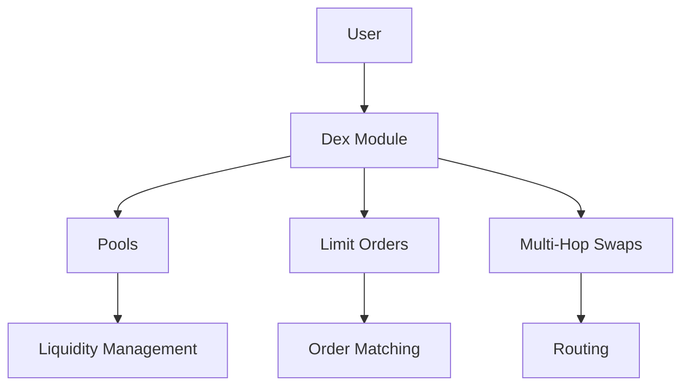
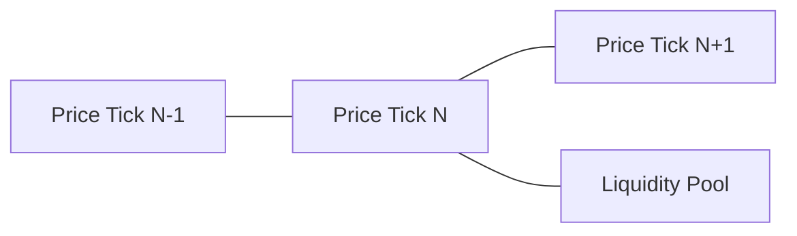
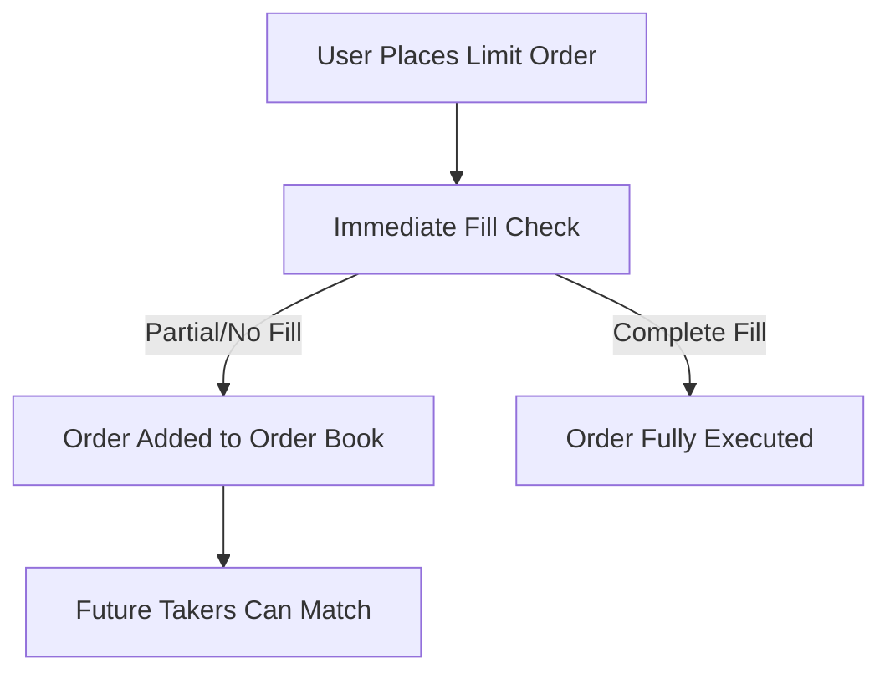

The Neutron Dex module implements a novel decentralized exchange model built around constant-price liquidity pools. This document explains the technical architecture and core concepts of the module.

## Architecture

The Dex module is designed around several key components that work together to provide comprehensive decentralized exchange functionality:

### Core Components

1. **Pools**: Concentrated liquidity pools organized by tick indexes and fee levels
2. **Limit Orders**: User-placed orders that provide directional liquidity
3. **Multi-Hop Swaps**: Efficient routing through multiple pools for optimal trade execution

## Constant-Price Pools

Unlike traditional AMMs that use continuous curves (like x*y=k), Neutron Dex uses discrete price points (ticks) where liquidity is concentrated:

Each price tick corresponds to a specific exchange rate between token pairs. This design:

- Enables zero slippage trades within a tick
- Allows predictable pricing for traders
- Provides capital efficiency for liquidity providers

### Tick System

The price for a tick index `i` is calculated as `p(i) = 1.0001^i`. This logarithmic spacing ensures:

- Equal percentage price changes between adjacent ticks
- Finer granularity near zero
- Compatibility with wide price ranges

## Liquidity Provision

Liquidity providers can add liquidity to specific price ticks with chosen fee levels:

1. **Deposit Process**:
   - Users specify token pairs, amounts, tick indexes, and fees
   - The system distributes liquidity across the specified ticks
   - Liquidity providers receive share tokens representing their position

2. **Share Tokens**:
   - Each pool has unique share tokens
   - Share tokens entitle holders to a proportional claim on pool assets
   - Used for tracking ownership and fee distribution

3. **Withdrawal Process**:
   - Users burn share tokens to withdraw underlying assets
   - Receive proportional amounts of both tokens in the pool

## Limit Orders

Limit orders in Neutron Dex function as one-sided liquidity provision:

### Limit Order Types

1. **Good Til Cancelled (GTC)**: Default order type that remains active until cancelled
2. **Fill or Kill (FOK)**: Must be fully filled immediately or rejected entirely
3. **Immediate or Cancel (IOC)**: Fills what's possible immediately, cancels remainder
4. **Just in Time (JIT)**: Special maker orders that await taker orders
5. **Good Til Time (GTT)**: Automatically expires at a specified time

### Order Execution Mechanics

1. **Order Placement**:
   - User specifies token in, token out, price, and amount
   - System calculates the tick index based on price
   - Order is split into maker and taker portions

2. **Taker Execution**:
   - Immediately matches against existing limit orders
   - Follows optimal routing through available liquidity

3. **Maker Placement**:
   - Remaining unmatched portion becomes a limit order
   - Added to the order book at specified price level

## Multi-Hop Swaps

For complex trades involving multiple token pairs, the Multi-Hop Swap functionality enables:

1. **Route Definition**:
   - Users can specify multiple possible routes
   - Each route is a sequence of token pairs

2. **Route Execution**:
   - System simulates all routes to find optimal path
   - Executes swap through the best route
   - Returns output token to user

3. **Price Protection**:
   - Users can set a minimum exit price
   - Transaction reverts if price requirements aren't met

## Fee Structure

Neutron Dex implements a flexible fee system:

1. **Pool Fees**:
   - Configurable at pool creation
   - Represented in basis points (1 bp = 0.01%)
   - Collected from traders and distributed to liquidity providers

2. **Fee Tiers**:
   - Different fee levels for different volatility expectations
   - Higher fees typically for more volatile pairs
   - Liquidity providers choose fee tiers based on risk preference

## State Management

The Dex module maintains several key state objects:

1. **Pool State**:
   - Pool identification (pair ID, tick index, fee)
   - Reserves of both tokens
   - Total shares issued

2. **Limit Order State**:
   - Order tranches grouped by pair, direction, and price
   - User order records
   - Filled and unfilled amounts

3. **User Positions**:
   - Deposit records
   - Active limit orders
   - Share token balances

## Pool Reserves and Price Calculation

Each pool maintains reserves of two tokens, and the exchange rate is determined by:

1. **Price Calculation**:
   - For tick index `i`, price = `1.0001^i`
   - This represents token1/token0 exchange rate

2. **Swap Execution**:
   - Within a tick: constant price swaps until reserves exhausted
   - Across ticks: execution at different prices as liquidity depletes

## Advanced Features

### Deposit Options

When depositing liquidity, users can specify options like:

1. **Disable Autoswap**: Prevent automatic balancing of deposit amounts
2. **Swap on Deposit**: Automatically swap tokens to achieve desired ratio
3. **Slippage Tolerance**: Maximum acceptable price impact during deposit

### Pool Metadata

The system maintains metadata about pools including:

1. **Creator Information**: Who created the pool
2. **Fee Distribution**: How fees are allocated
3. **Additional Settings**: Custom pool parameters 