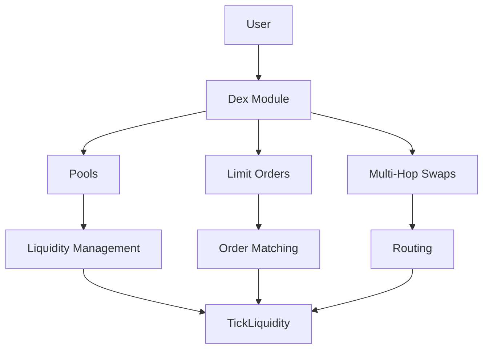
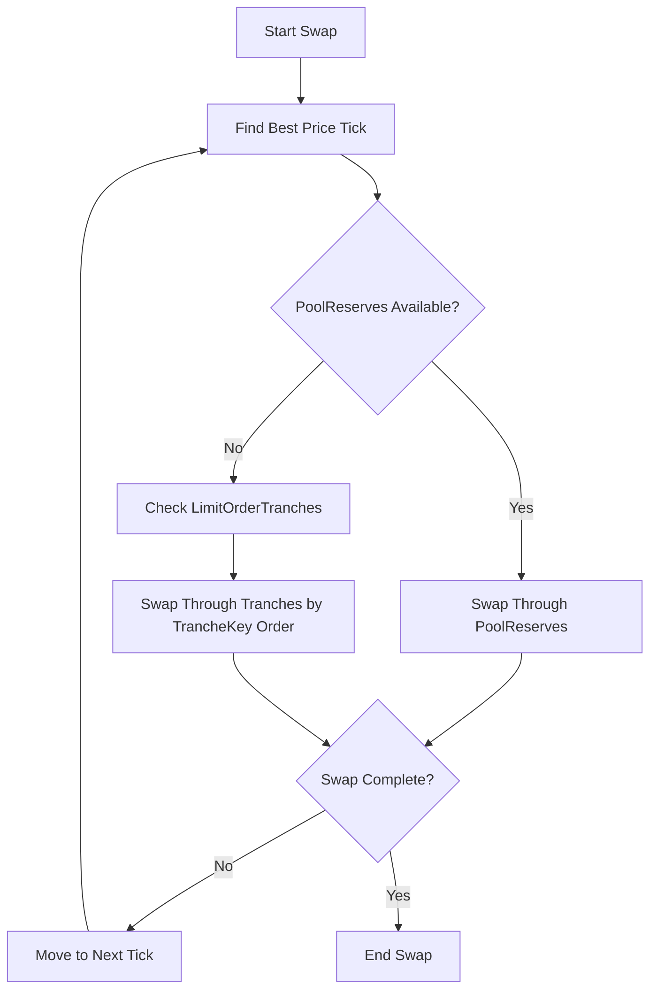
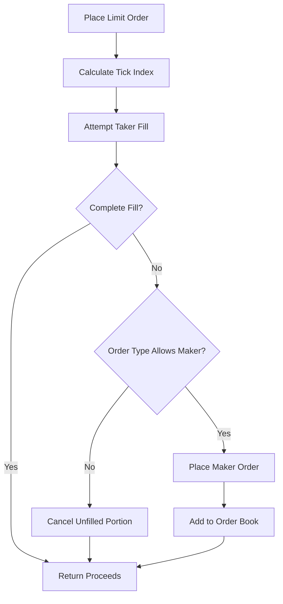

The Neutron Dex module implements a novel decentralized exchange model built around constant-price liquidity pools. This document explains the technical architecture and core concepts of the module.

## Architecture Overview

The Neutron DEX combines the best of AMMs and orderbooks into a unified system. It achieves orderbook-level capital efficiency (zero price impact trades) while maintaining the computational efficiency and liveness properties of AMMs.



### Core Components

1. **TickLiquidity**: The fundamental building block storing liquidity at discrete price points
2. **Pools**: Concentrated liquidity pools organized by tick indexes and fee levels
3. **Limit Orders**: User-placed orders that provide directional liquidity
4. **Multi-Hop Swaps**: Efficient routing through multiple pools for optimal trade execution

## Tick System

Ticks are the fundamental unit of accounting within the DEX. Each tick is an integer between -559,680 and 559,680, representing discrete price points where liquidity can be stored.

### Price Calculation

The price for liquidity held at tick `i` is determined by:

$$p(i) = 1.0001^{i}$$

This exponential function provides:
- Equal percentage price changes between adjacent ticks (0.01% per tick)
- Finer granularity near zero
- Compatibility with wide price ranges

**Examples:**
- Tick 0: $p(0) = 1.0001^0 = 1$
- Tick 1: $p(1) = 1.0001^{1} = 1.0001$
- Tick -1: $p(-1) = 1.0001^{-1} ≈ 0.9999$
- Tick 4000: $p(4000) = 1.0001^{4000} ≈ 1.4918$
- Tick -4000: $p(-4000) = 1.0001^{-4000} ≈ 0.6703$

### Price Conversion

To convert between price and tick index:

**Price to Tick:**
$$\text{tickIndex} = \frac{\log(\text{price})}{\log(1.0001)}$$

**Tick to Price:**
$$\text{price} = 1.0001^{\text{tickIndex}}$$

### MakerPrice Concept

`MakerPrice` represents the rate for converting `MakerDenom` to `TakerDenom`:

$$\text{MakerDenom} \times \text{MakerPrice} = \text{TakerDenom}$$

Conversely:
$$\frac{\text{TakerDenom}}{\text{MakerPrice}} = \text{MakerDenom}$$

**Example:** For an ATOM/USDC pair at price 10 USDC per ATOM:
- ATOM liquidity placed at tick +23027 (price = 10 USDC)
- USDC liquidity placed at tick -23027 (price = 0.1 ATOM)

## TickLiquidity Types

`TickLiquidity` is a union type that can represent two forms of liquidity:

### 1. PoolReserves (AMM Liquidity)

PoolReserves represent traditional AMM liquidity where both sides of a pair are provided:

```go
type PoolReserves struct {
    Key                *PoolReservesKey
    ReservesMakerDenom Int
    MakerPrice         PrecDec
}

type PoolReservesKey struct {
    TradePairId           *TradePairID
    TickIndexTakerToMaker int64
    Fee                   uint64
}
```

**Key Properties:**
- Exist in reciprocal pairs (LowerTick0 and UpperTick1)
- Both sides have the same fee
- Tokens are added to one side and deducted from the other during swaps
- Multiple PoolReserves can exist at the same tick with different fees

### 2. LimitOrderTranche (Limit Order Liquidity)

LimitOrderTranches store limit order liquidity:

```go
type LimitOrderTranche struct {
    Key                *LimitOrderTrancheKey
    ReservesMakerDenom Int
    ReservesTakerDenom Int
    TotalMakerDenom    Int
    TotalTakerDenom    Int
    ExpirationTime     *time.Time
    MakerPrice         PrecDec
}

type LimitOrderTrancheKey struct {
    TradePairId           *TradePairID
    TickIndexTakerToMaker int64
    TrancheKey            string
}
```

**Key Properties:**
- `TrancheKey` provides unique identification and lexicographic ordering
- `ReservesMakerDenom`: Available tokens from the maker
- `ReservesTakerDenom`: Filled amount available for withdrawal
- `TotalMakerDenom`/`TotalTakerDenom`: High watermarks for accounting
- `ExpirationTime`: Optional field for time-based orders

## Pair ID System

PairIDs provide canonical identification for token pairs:

```go
type PairID struct {
    Token0 string  // Alphabetically first token
    Token1 string  // Alphabetically second token
}
```

**Rules:**
- Tokens are sorted alphabetically
- Stringified as `Token0<>Token1` (e.g., "ATOM<>USDC")
- Ensures uniqueness and consistency across the system

## Pool Structure

A Pool contains information for a single constant-priced AMM:

```go
type Pool struct {
    Id         uint64
    LowerTick0 *PoolReserves  // Holds Token0
    UpperTick1 *PoolReserves  // Holds Token1
}
```

**Pool Invariants:**
- Both PoolReserves have the same fee: `LowerTick0.Key.Fee == UpperTick1.Key.Fee`
- Swaps add tokens to one side and deduct from the other
- Fee is included in the tick placement

## Liquidity Iteration Mechanism

When executing swaps, the system iterates through available liquidity in order of best to worst price from the taker's perspective.

### Iteration Order

For liquidity at the same tick index:
1. **PoolReserves take priority**
2. **LimitOrderTranches** are processed after PoolReserves are exhausted
3. **LimitOrderTranches** are ordered alphabetically by `TrancheKey`

### Swap Execution Process



### Example: Liquidity Iteration

**Setup:**
- Deposit 1: 10 ATOM at 8 USDC/ATOM (tick 20795)
- Deposit 2: 10 ATOM at 9 USDC/ATOM (tick 21973)  
- Deposit 3: 10 ATOM at 10 USDC/ATOM (tick 23027)
- Limit Order: 10 ATOM at 7 USDC/ATOM (tick 19640)

**Alice swaps 100 USDC for ATOM:**

1. **First tick (19640)**: LimitOrderTranche offers cheapest ATOM
   - Swaps 71.27 USDC for 10 ATOM
   - Calculation: $10 \times 1.0001^{19640} = 71.27$ USDC

2. **Second tick (20795)**: PoolReserves at 8 USDC/ATOM
   - Swaps remaining 28.73 USDC for 3.59 ATOM
   - Calculation: $\frac{28.73}{1.0001^{20795}} = 3.59$ ATOM

3. **Result**: 100 USDC → 13.59 ATOM (average price: 0.136 ATOM/USDC)

## Deposit Mechanisms

### Basic Deposit Process

When depositing liquidity, the system maintains pool ratios:

$$\text{true}_0 = \min\left(\text{amountDeposited}_0, \frac{\text{existingReserves}_0}{\text{existingReserves}_1} \times \text{amountDeposited}_1\right)$$

$$\text{true}_1 = \min\left(\text{amountDeposited}_1, \frac{\text{existingReserves}_1}{\text{existingReserves}_0} \times \text{amountDeposited}_0\right)$$

### Share Token Calculation

Share tokens are issued based on the value deposited:

$$\text{valueDeposited} = \text{true}_0 + p(i) \times \text{true}_1$$

$$\text{newShares} = \frac{\text{valueDeposited} \times \text{totalShares}}{\text{valueTotal}}$$

### Behind Enemy Lines (BEL)

To maintain DEX invariants, users cannot deposit liquidity at prices cheaper than the opposing bid price. BEL deposits are rejected unless the `FailTxOnBEL` option is disabled.

### Autoswap Mechanism

When enabled, autoswap allows users to deposit their full specified amounts by automatically balancing the ratio:

**Residual Calculation:**
$$s = \frac{\text{existingReserves}_0 \times \text{amountDeposited}_1 - \text{existingReserves}_1 \times \text{amountDeposited}_0}{\text{existingReserves}_1 \times \text{price} + \text{existingReserves}_0}$$

**Autoswap Fee:**
$$\text{autoswapFee} = (\text{residual}_0 + \text{residual}_1 \times \text{price1To0}) \times (1 - p(\text{fee}))$$

**Final Shares:**
$$\text{newShares} = \frac{(\text{valueDeposited} - \text{autoswapFee}) \times \text{totalShares}}{\text{valueTotal} + \text{autoswapFee}}$$

## Fee System

### Fee Structure

Fees are represented in basis points (1 bp = 0.01%):

**Common Fee Tiers:**
- 1 bp (0.01%): Ultra-low volatility pairs
- 5 bp (0.05%): Stable pairs
- 30 bp (0.3%): Standard pairs
- 100 bp (1%): Exotic pairs
- 300 bp (3%): Highly volatile pairs

### Fee Mathematics

For a swap with fee γ:

**Token A → Token B:**
$$\text{amountOut} = p \times (1 - \gamma) \times \text{amountIn}$$

**Token B → Token A:**
$$\text{amountOut} = \frac{(1 - \gamma) \times \text{amountIn}}{p}$$

### Fee Strategy

- **Low volatility pairs**: Race to the bottom on fees to attract volume
- **High volatility pairs**: Higher fees to compensate for impermanent loss risk
- **Liquidity providers**: Balance between attracting volume and earning fees

## Limit Order Mechanics

### Order Types and Behavior

1. **GOOD_TIL_CANCELLED (GTC)**
   - Hybrid maker/taker orders
   - Immediate taker execution, remainder becomes maker order
   - Remains active until cancelled

2. **FILL_OR_KILL (FOK)**
   - Pure taker orders
   - Must fill completely or fail entirely
   - No maker portion

3. **IMMEDIATE_OR_CANCEL (IOC)**
   - Pure taker orders
   - Fill what's possible immediately
   - Cancel unfilled portion

4. **JUST_IN_TIME (JIT)**
   - Advanced maker orders
   - Active for exactly one block
   - Auto-cancelled after expiration

5. **GOOD_TIL_TIME (GTT)**
   - Like GTC but with expiration time
   - Auto-cancelled after expiration

### Order Execution Flow



## Multi-Hop Swaps

### Route Execution

Multi-hop swaps enable optimal price discovery across multiple token pairs:

1. **Route Definition**: Sequence of token denominations
2. **Route Simulation**: Test all provided routes
3. **Best Route Selection**: Choose route with highest output (if `pick_best_route` enabled)
4. **Sequential Execution**: Execute each hop in sequence

### Price Protection

Exit limit price ensures minimum acceptable conversion rate:

$$\text{ExitLimitPrice} \leq \frac{\text{AmountOfExitToken}}{\text{AmountIn}}$$

## State Management

### Pool State Objects

- **Pool Identification**: PairID + TickIndex + Fee
- **Reserves**: Token amounts for both sides
- **Share Tokens**: Outstanding shares and ownership tracking

### Limit Order State Objects

- **Order Tranches**: Grouped by pair, direction, and price
- **User Records**: Individual user positions in tranches
- **Fill Tracking**: Filled vs unfilled amounts

### User Position Tracking

- **Deposit Records**: LP positions with share ownership
- **Active Orders**: Outstanding limit orders
- **Balance Management**: Share token balances and claims

## Advanced Features

### Deposit Options

```go
type DepositOptions struct {
    DisableAutoswap                    bool
    FailTxOnBel                       bool
    SwapOnDeposit                     bool
    SwapOnDepositSlopToleranceBps     uint64
}
```

### Pool Metadata

Comprehensive tracking of pool information:
- Creator and creation details
- Fee distribution mechanisms
- Custom pool parameters
- Historical performance data

### Simulation Capabilities

The DEX provides simulation endpoints for:
- Deposit outcome prediction
- Withdrawal calculations
- Swap result estimation
- Limit order fill simulation

This enables users to understand transaction outcomes before execution, improving user experience and reducing failed transactions. 