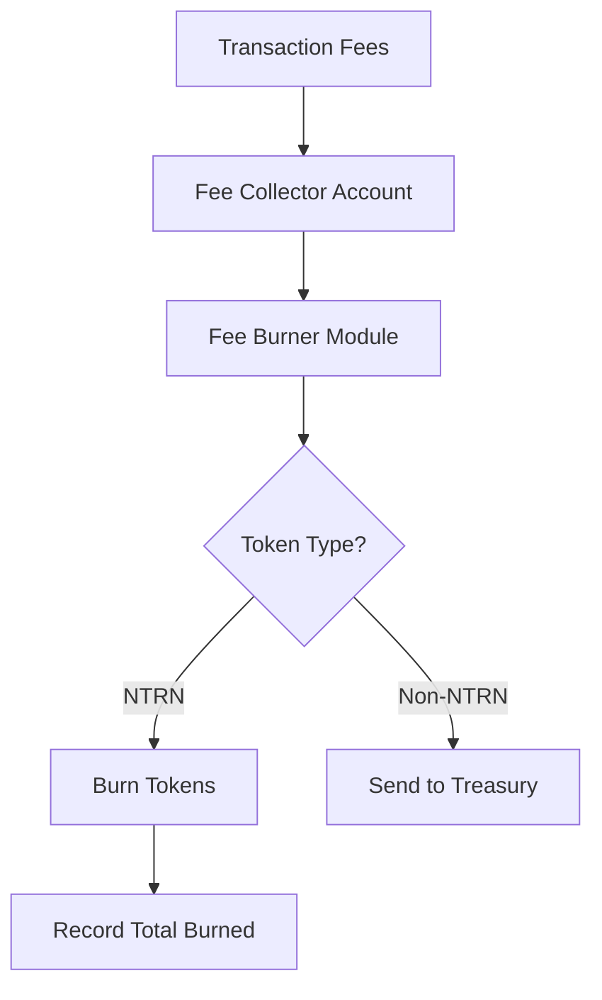

This document explains the principles, architecture, and internal mechanisms of the Fee Burner module.

## Core Concepts

### Fee Collection in Sovereign Neutron

Following the Mercury upgrade in April 2025, Neutron operates as a fully sovereign network with its own validator set and native NTRN staking. Transaction fees collected on Neutron are processed entirely within the network through the Fee Burner module.

All transaction fees are initially collected in the fee collector account during block execution, and the Fee Burner module processes these fees at the end of each block.

### Deflationary Mechanism

The primary function of the Fee Burner is to implement a deflationary tokenomics model through:

- **Systematic Burning**: By destroying NTRN tokens collected as fees, the module reduces the total supply over time
- **Supply Contraction**: As usage of the network increases, more fees are collected and burned, creating stronger deflationary pressure

This mechanism helps maintain long-term value for NTRN token holders while supporting Neutron's fixed supply tokenomics model introduced with the Mercury upgrade.

### Treasury Funding

For fees collected in non-NTRN denominations (such as IBC tokens), the module:

1. Identifies all non-NTRN tokens in the fee collector account
2. Transfers these tokens to the Treasury address specified in the module parameters
3. Enables ecosystem funding without creating additional NTRN tokens

The Treasury can then use these funds for ecosystem development, grants, and other initiatives as governed by the Neutron DAO.

## Architecture

## Implementation Details

### End Block Execution

The Fee Burner module's core functionality executes at the end of every block through the `EndBlock` handler. During this process:

1. The module accesses the fee collector account
2. Retrieves all token balances from this account
3. Processes each token denomination according to the module's rules

This automatic execution ensures consistent application of the tokenomics policy without requiring manual intervention.

### NTRN Token Burning

When the module encounters NTRN tokens (identified by the `neutron_denom` parameter):

1. The tokens are burned using the SDK's `BurnCoins` function
2. The burned amount is added to the running total of burned tokens
3. The updated total is stored in the module's state

This process permanently removes these tokens from circulation, ensuring they can never be recovered or reused.

### Non-NTRN Token Handling

For all other token denominations:

1. The module aggregates them into a single collection
2. Retrieves the Treasury address from the module parameters
3. Transfers the entire collection to the Treasury address

If the Treasury address is invalid or not configured, the module will burn these tokens as a fallback measure to prevent accumulation.

### State Management

The module maintains minimal state information:

1. **Module Parameters**: Configuration settings for the module operation
2. **Total Burned Amount**: A running record of all NTRN tokens burned since genesis

This state is accessible through the module's query endpoints, allowing transparency about the deflationary impact over time.

## Economic Implications

The Fee Burner module plays a crucial role in Neutron's sovereign economic model:

1. **Supply Control**: By continuously reducing the circulating supply of NTRN, the module helps maintain token value
2. **Usage-Based Deflation**: The more the network is used, the more tokens are burned, creating a positive feedback loop
3. **Ecosystem Sustainability**: Non-NTRN fees provide funding for ecosystem development without diluting token value
4. **Fixed Supply Preservation**: Supports Neutron's fixed supply tokenomics introduced with the Mercury upgrade

This balanced approach ensures that both token holders and the broader ecosystem benefit from network growth while maintaining the deflationary characteristics essential to Neutron's sovereign tokenomics model. 