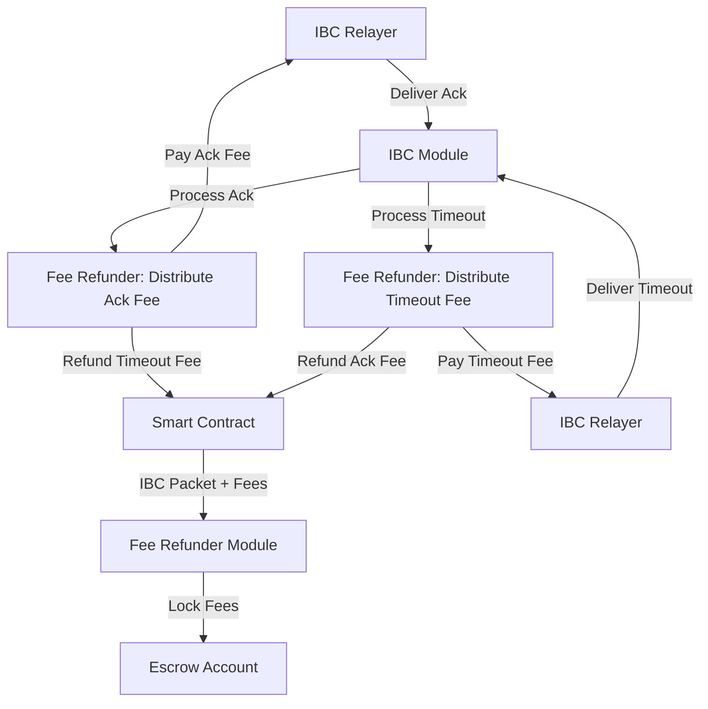

This document explains the principles, architecture, and internal mechanisms of the Fee Refunder module.

## Core Concepts

### The IBC Relayer Challenge

IBC relayers perform the critical task of facilitating communication between blockchains. They:

1. Monitor packets on the source chain
2. Submit proofs of these packets to the destination chain
3. Return acknowledgements or timeouts back to the source chain

However, this work incurs costs in gas fees, creating an economic challenge: How do we ensure relayers are properly compensated for their services?

### The Spam Attack Problem

Without an appropriate fee mechanism, the IBC infrastructure is vulnerable to abuse:

1. Malicious actors could send numerous IBC packets without paying for the relaying costs
2. Smart contracts could deliberately create infinite loops of IBC messages (send → acknowledge → send new message → acknowledge → etc.)
3. Relayers would quickly stop serving chains where they consistently lose money

### The Solution

The Fee Refunder module provides a solution inspired by, but not fully implementing, the [ICS-29 specification](https://github.com/cosmos/ibc/tree/main/spec/app/ics-029-fee-payment):

1. **Fee Pre-payment**: Smart contracts must pre-pay fees for acknowledgement and timeout handling
2. **Fee Escrow**: Fees are locked in the module until the packet is resolved
3. **Conditional Refunds**: Depending on the packet outcome (ack or timeout), the appropriate fee is distributed

This creates a sustainable economic model for both the chain and its relayers.

## Architecture



## Implementation Details

### Fee Structure

The `Fee` structure includes:

```protobuf
message Fee {
  repeated cosmos.base.v1beta1.Coin recv_fee = 1;
  repeated cosmos.base.v1beta1.Coin ack_fee = 2;
  repeated cosmos.base.v1beta1.Coin timeout_fee = 3;
}
```

- `ack_fee`: Coins paid to the relayer who delivers the acknowledgement
- `timeout_fee`: Coins paid to the relayer who delivers the timeout
- `recv_fee`: Currently must be zero (used for ICS-29 compatibility)

### Fee Locking

When a smart contract sends an IBC packet (via `MsgTransfer` or `MsgSubmitTx`), the module:

1. Validates that the provided fees meet the minimum requirements
2. Locks the total fee amount (ack_fee + timeout_fee) in the module's account
3. Stores the fee information associated with the packet ID

```go
func (k Keeper) LockFees(ctx context.Context, payer sdk.AccAddress, packetID types.PacketID, fee types.Fee) error {
    // Validate fees against minimum required
    if err := k.checkFees(ctx, fee); err != nil {
        return errors.Wrapf(err, "failed to lock fees")
    }

    // Store fee information
    feeInfo := types.FeeInfo{
        Payer:    payer.String(),
        Fee:      fee,
        PacketId: packetID,
    }
    k.StoreFeeInfo(ctx, feeInfo)

    // Transfer fees to module account
    if err := k.bankKeeper.SendCoinsFromAccountToModule(ctx, payer, types.ModuleName, fee.Total()); err != nil {
        return errors.Wrapf(err, "failed to send coins during fees locking")
    }

    // Emit events
    // ...
    return nil
}
```

### Fee Distribution for Acknowledgements

When an IBC acknowledgement is received, the module:

1. Retrieves the stored fee information for the packet
2. Sends the acknowledgement fee to the relayer who delivered the ack
3. Returns the timeout fee to the original payer (smart contract)
4. Removes the fee information from storage

```go
func (k Keeper) DistributeAcknowledgementFee(ctx context.Context, receiver sdk.AccAddress, packetID types.PacketID) {
    // Retrieve fee info
    feeInfo, err := k.GetFeeInfo(ctx, packetID)
    if err != nil {
        panic(errors.Wrapf(err, "no fee info"))
    }

    // Distribute ack fee to relayer
    if err := k.distributeFee(ctx, receiver, feeInfo.Fee.AckFee); err != nil {
        panic(errors.Wrapf(err, "error distributing ack fee"))
    }

    // Return unused timeout fee to original payer
    if err := k.distributeFee(ctx, sdk.MustAccAddressFromBech32(feeInfo.Payer), feeInfo.Fee.TimeoutFee); err != nil {
        panic(errors.Wrapf(err, "error distributing unused timeout fee"))
    }

    // Emit events and clean up
    // ...
    k.removeFeeInfo(ctx, packetID)
}
```

### Fee Distribution for Timeouts

When an IBC timeout is received, the module:

1. Retrieves the stored fee information for the packet
2. Sends the timeout fee to the relayer who delivered the timeout
3. Returns the acknowledgement fee to the original payer (smart contract)
4. Removes the fee information from storage

```go
func (k Keeper) DistributeTimeoutFee(ctx context.Context, receiver sdk.AccAddress, packetID types.PacketID) {
    // Retrieve fee info
    feeInfo, err := k.GetFeeInfo(ctx, packetID)
    if err != nil {
        panic(errors.Wrapf(err, "no fee info"))
    }

    // Distribute timeout fee to relayer
    if err := k.distributeFee(ctx, receiver, feeInfo.Fee.TimeoutFee); err != nil {
        panic(errors.Wrapf(err, "error distributing timeout fee"))
    }

    // Return unused ack fee to original payer
    if err := k.distributeFee(ctx, sdk.MustAccAddressFromBech32(feeInfo.Payer), feeInfo.Fee.AckFee); err != nil {
        panic(errors.Wrapf(err, "error distributing unused ack fee"))
    }

    // Emit events and clean up
    // ...
    k.removeFeeInfo(ctx, packetID)
}
```

### Minimum Fee Enforcement

To prevent spam and ensure relayers are properly compensated, the module enforces minimum fees:

1. Governance sets minimum required fees via the `min_fee` parameter
2. The `checkFees` function validates that provided fees meet or exceed these minimums
3. Transactions with insufficient fees are rejected

```go
func (k Keeper) checkFees(ctx sdk.Context, fees types.Fee) error {
    params := k.GetParams(ctx)

    if !fees.TimeoutFee.IsAnyGTE(params.MinFee.TimeoutFee) {
        return errors.Wrapf(sdkerrors.ErrInsufficientFee, "provided timeout fee is less than min governance set timeout fee")
    }

    if !fees.AckFee.IsAnyGTE(params.MinFee.AckFee) {
        return errors.Wrapf(sdkerrors.ErrInsufficientFee, "provided ack fee is less than min governance set ack fee")
    }

    // Additional validations...
    return nil
}
```

## Compatibility with ICS-29

While inspired by ICS-29, the Fee Refunder module operates independently for several reasons:

1. **Compatibility**: It allows Neutron to connect with chains that don't support ICS-29
2. **Interface Consistency**: It maintains the same API interface as ICS-29 for developer ease
3. **Future Upgrade Path**: When Neutron eventually supports native ICS-29, contracts won't need changes

The key difference is that the Fee Refunder only handles acknowledgements and timeouts, not receive packets, as those would require support from counterparty chains.

## Security Considerations

The module includes several security measures:

1. **Atomic Operations**: Fee locking and distribution use atomic operations to prevent partial state changes
2. **Escrow Model**: Fees are locked until packet resolution, ensuring relayers can trust they'll be paid
3. **Fee Validation**: Only allowed denominations with sufficient amounts can be used as fees
4. **Receive Fee Prevention**: Receive fees are prohibited to prevent compatibility issues with other chains 