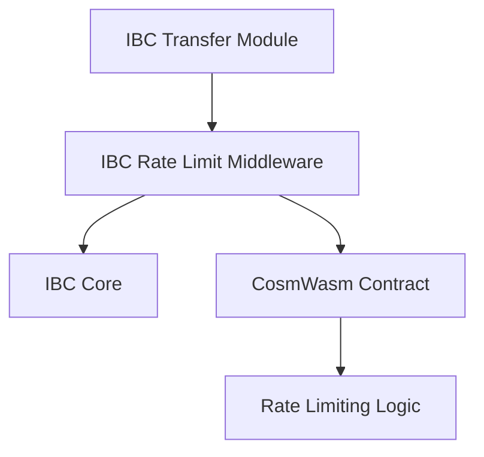

The IBC Rate Limit module is a minimal IBC middleware that forwards packet information to a CosmWasm contract for rate limiting decisions. This document explains the module's architecture and core functionality.

## Module Purpose

The IBC Rate Limit module provides a standardized interface between IBC transfers and external rate limiting logic implemented in CosmWasm contracts. By delegating all rate limiting decisions to a contract, the module enables flexible rate limiting strategies that can be updated without chain upgrades.

## Architecture Overview

The IBC Rate Limit module employs a minimal Go middleware pattern:



This architecture provides:

1. **Minimal Chain Code**: The Go middleware only handles packet forwarding and error handling
2. **Contract Flexibility**: All rate limiting logic is delegated to the CosmWasm contract
3. **Governance Updates**: Contract address can be updated via governance proposals

## Core Module Functionality

### Parameter Management

The module manages a single parameter:
- **contract_address**: The address of the CosmWasm contract that handles rate limiting decisions

### Packet Forwarding

When IBC packets are processed, the module:

1. **On Send**: Forwards packet information to the contract via `send_packet` message
2. **On Receive**: Forwards packet information to the contract via `recv_packet` message  
3. **On Failure**: Calls the contract's `undo_send` function for failed packets

### Contract Message Interface

The module sends standardized messages to the contract:

#### Send Packet Message
```json
{
  "send_packet": {
    "packet": {
      "sequence": 0,
      "source_port": "transfer",
      "source_channel": "channel-0",
      "destination_port": "omitted",
      "destination_channel": "omitted",
      "data": {
        "denom": "untrn",
        "amount": "1000000",
        "sender": "neutron1...",
        "receiver": "cosmos1..."
      },
      "timeout_height": {},
      "timeout_timestamp": 0
    }
  }
}
```

#### Receive Packet Message
```json
{
  "recv_packet": {
    "packet": {
      // Same structure as send_packet
    }
  }
}
```

#### Undo Send Message
```json
{
  "undo_send": {
    "packet": {
      // Same structure as send_packet
    }
  }
}
```

### Error Handling

The module handles contract responses by checking the error message content:

- **Success**: Packet processing continues normally
- **Rate Limit Detection**: If contract error contains "rate limit exceeded", returns `ErrRateLimitExceeded`
- **Other Contract Errors**: All other contract errors return `ErrContractError`

### Failed Packet Processing

When packets fail (timeout or error acknowledgment), the module automatically:

1. Detects the failure in `OnAcknowledgementPacket` or `OnTimeoutPacket`
2. Calls the contract's `undo_send` function
3. Emits a `bad_revert` event if the undo operation fails

## Module Events

The module emits events for debugging failed packet reversions:

### EventBadRevert
- **Type**: `bad_revert`
- **Attributes**:
  - `module`: `rate-limited-ibc`
  - `failure_type`: `acknowledgment` or `timeout`
  - `packet`: The packet data
  - `acknowledgement`: The acknowledgement data (for acknowledgment failures)

## Governance Integration

The module integrates with governance through:

- **MsgUpdateParams**: Allows governance to update the contract address
- **Authority Validation**: Only the governance authority can update parameters

<Warning>
**Contract-Specific Behavior**: The actual rate limiting logic (quotas, time periods, flow tracking, token denomination handling, etc.) is entirely contract-specific and not implemented in the Go module. Different contracts may implement completely different rate limiting strategies.
</Warning>

## No Built-in Rate Limiting

Important limitations of the module:

- **No Quota Management**: The module does not track or manage quotas
- **No Time Period Logic**: No concept of time windows or periods
- **No Flow Tracking**: Does not track token flows or calculate limits
- **No Token Processing**: Does not handle token denomination logic
- **No Channel Values**: Does not calculate or cache channel values

All rate limiting functionality must be implemented in the CosmWasm contract.
```