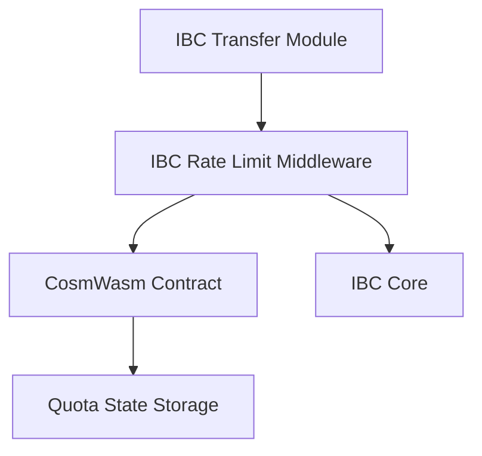

The IBC Rate Limit module provides a safety control mechanism for IBC transfers by imposing configurable limits on the flow of tokens through IBC channels. This document explains the architecture and concepts behind the rate limiting system.

## Motivation

IBC Rate Limits were designed in response to observations from major bridge hacks across the blockchain ecosystem. These incidents demonstrated that even when bridge exploits occur, limits on withdrawal rates can significantly reduce the impact:

- A 30% asset depeg is substantially better than a 100% depeg
- Rate limits provide time for validators and developers to identify and respond to exploits
- The sacrifice of liveness in high-volume scenarios is a reasonable tradeoff for improved security against catastrophic losses

## Architecture Overview

The IBC Rate Limit module employs a minimal Go middleware pattern combined with a CosmWasm contract for the rate limiting logic:

This architecture provides several key benefits:

1. **Governance Flexibility**: The core rate limiting logic is in a CosmWasm contract that can be updated via governance proposals without requiring a chain upgrade
2. **Minimal Chain Code**: The Go middleware is minimal, primarily responsible for routing IBC packets to the contract
3. **Separation of Concerns**: The middleware handles IBC packet interception, while the contract handles quota tracking and enforcement

## Rate Limiting Concepts

### Paths and Quotas

The fundamental units in the rate limiting system are:

- **Path**: A combination of token denomination and IBC channel
- **Quota**: A percentage-based limit on token flow through a path over a specific time period
- **Flow**: The amount of tokens that have moved through a path during the current time window

Each path can have multiple quotas with different time periods (e.g., daily, weekly, monthly).

### Time-Based Periods

Rate limits are defined in discrete time-based periods rather than rolling windows. Each period has:

- A specific duration (e.g., 6 hours, 1 day, 1 week)
- A start time when the quota refreshes
- A tracked amount of tokens that have flowed through the path during the period

When a period ends, the quota automatically refreshes for the next period.

### Inflow vs. Outflow

The system maintains separate quotas for:

- **Inflow**: Tokens coming into Neutron from other chains (protection against bugs on counterparty chains)
- **Outflow**: Tokens leaving Neutron to other chains (protection against bugs on Neutron itself)

Each direction can have different quota percentages based on the risk assessment and expected usage patterns.

### Net Flow Tracking

A critical aspect of the system is that it tracks the **net flow** of assets rather than the gross flow. This means:

- If 100 ATOM flows out of Neutron and then 60 ATOM flows back in, the net outflow is only 40 ATOM
- This prevents denial-of-service attacks where an attacker could repeatedly send tokens back and forth to trigger rate limits

## Processing Flow

### On Token Send

When a token is sent via IBC from Neutron:

1. The IBC Transfer module prepares the outgoing packet
2. The Rate Limit middleware intercepts the packet
3. The middleware calls the CosmWasm contract with the packet details
4. The contract:
   - Identifies the path (token + channel)
   - Calculates the current quotas
   - Updates the outflow tracking
   - Verifies the transaction doesn't exceed any quota
5. If any quota is exceeded, the transaction is rejected with a rate limit error
6. If all quotas are within limits, the packet proceeds to the IBC core for transmission

### On Token Receive

When a token is received via IBC to Neutron:

1. The IBC core delivers the packet to the middleware
2. The middleware calls the CosmWasm contract with the packet details
3. The contract:
   - Identifies the path
   - Calculates the current quotas
   - Updates the inflow tracking
   - Verifies the transaction doesn't exceed any quota
4. If any quota is exceeded, the packet is rejected with a rate limit error
5. If all quotas are within limits, the packet is forwarded to the IBC Transfer module

### On Failed Send

If a sent packet fails (timeout or error acknowledgment):

1. The middleware receives the error or timeout notification
2. The middleware calls the contract's "undo send" function
3. The contract reverses the quota accounting for the failed packet
4. This ensures failed transfers don't consume quota unnecessarily

## Token Denomination Handling

The module handles different token types with specific logic:

### Native Tokens

For Neutron's native tokens (e.g., NTRN):

- When sent: The token is tracked as-is in its native denomination
- When received: The token is recognized by removing the IBC prefix added by the counterparty chain

### Non-Native (IBC) Tokens

For tokens that originated from other chains:

- When sent: The token is tracked by its IBC denomination on Neutron (`ibc/...`)
- When received: The token is tracked based on its denomination path on Neutron

## Channel Value Calculation

To establish meaningful percentage-based limits, the system needs to determine the total value of tokens available on each channel:

- For non-native tokens (`ibc/...`), the channel value is the total supply of those tokens on Neutron
- For native tokens, the ideal would be to track the total amount in escrow across all IBC channels
  - Currently, due to IBC limitations, the system uses the current supply on Neutron for all denominations

The channel value is cached at the beginning of each quota period to provide predictability and prevent issues if there's a sudden change in token supply.

## Governance Control

The rate limit system provides several governance controls:

1. **Adding Paths and Quotas**: Governance can add new rate limits for specific path and time period combinations
2. **Removing Paths**: Governance can remove rate limits from specific paths
3. **Resetting Quotas**: If a rate limit has been reached, governance can reset it without waiting for the period to end
4. **Updating Contract**: The contract itself can be updated through governance proposals

These controls allow the system to adapt to changing security needs and market conditions without requiring chain upgrades. 