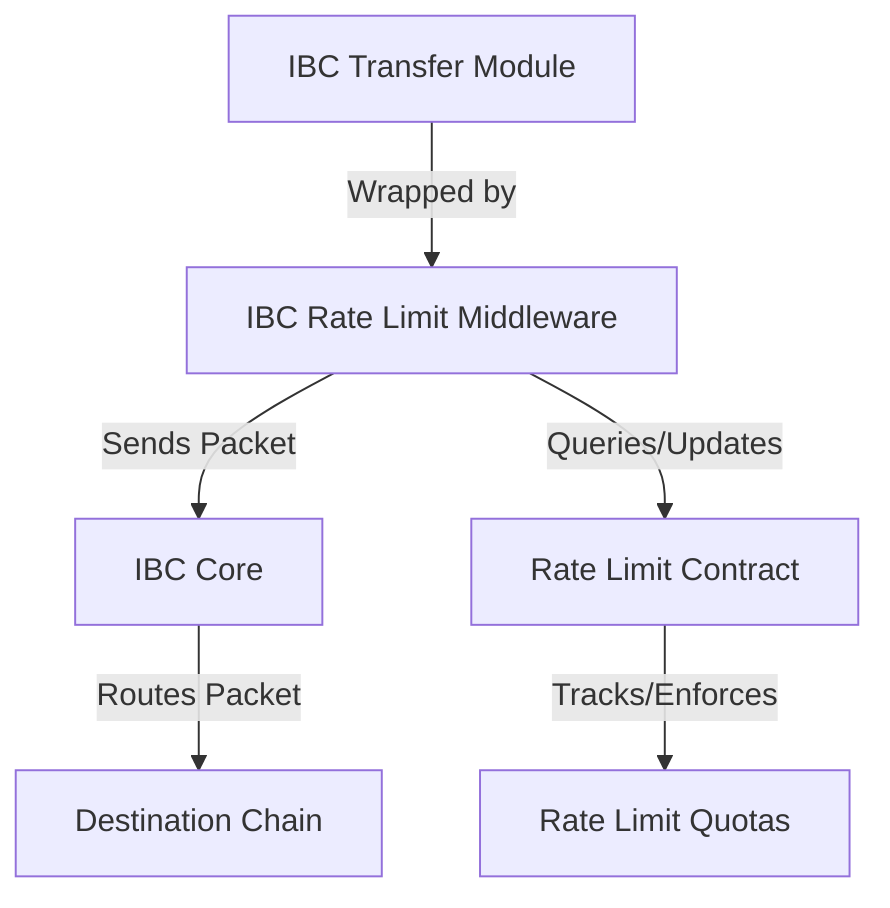

The IBC Rate Limit module provides governance-configurable rate limiting for IBC transfers. It acts as a critical safety control to protect assets on Neutron in the event of security incidents such as bugs or hacks on Neutron, counter-party chains, or in the IBC protocol itself.

## Key Features

<CardGroup cols={2}>
  <Card title="Configurable Rate Limits" icon="sliders">
    Set percentage-based quotas for IBC token transfers on a per-channel and per-denomination basis.
  </Card>
  <Card title="Time-Based Periods" icon="calendar">
    Define rate limits for different time windows (daily, weekly, etc.) to allow flexibility while maintaining security.
  </Card>
  <Card title="Separate Inflow/Outflow Controls" icon="arrows-up-down">
    Different rate limits for incoming and outgoing transfers to provide precise control over token flows.
  </Card>
  <Card title="Governance-Managed" icon="users-gear">
    All rate limits can be configured or reset by governance, allowing for adaptive security without requiring chain upgrades.
  </Card>
</CardGroup>

## Usage Examples

- **Preventing Complete Depegs**: In the event of an exploit, rate limits ensure that only a portion of bridged assets can be extracted, preventing complete depegs
- **Giving Time to React**: Provides time for validators and developers to analyze and respond to suspicious activity before significant fund loss occurs
- **Balancing Security and Usability**: Sets reasonable constraints on token transfers while maintaining regular functionality for normal usage

## Module Interactions

The IBC Rate Limit module operates as an IBC middleware that:

- Wraps around the ICS-20 Transfer module
- Delegates rate limiting logic to a CosmWasm contract
- Intercepts IBC packet sending and receiving operations
- Tracks token flows and enforces defined quotas

## Architecture

The design uses a minimal Go middleware component that delegates the rate limiting logic to a CosmWasm contract, allowing governance to update rate limiting strategies without requiring chain upgrades.

## Learn More

<CardGroup cols={2}>
  <Card title="How IBC Rate Limits Work" icon="book" href="/developers/modules/ibc-rate-limit/explanation">
    Understand the concepts and mechanics behind IBC rate limiting
  </Card>
  <Card title="Implementation Guide" icon="code" href="/developers/modules/ibc-rate-limit/how-to">
    Learn how to configure and manage rate limits
  </Card>
  <Card title="Technical Reference" icon="file-code" href="/developers/modules/ibc-rate-limit/reference">
    View technical specifications and parameter formats
  </Card>
</CardGroup> 