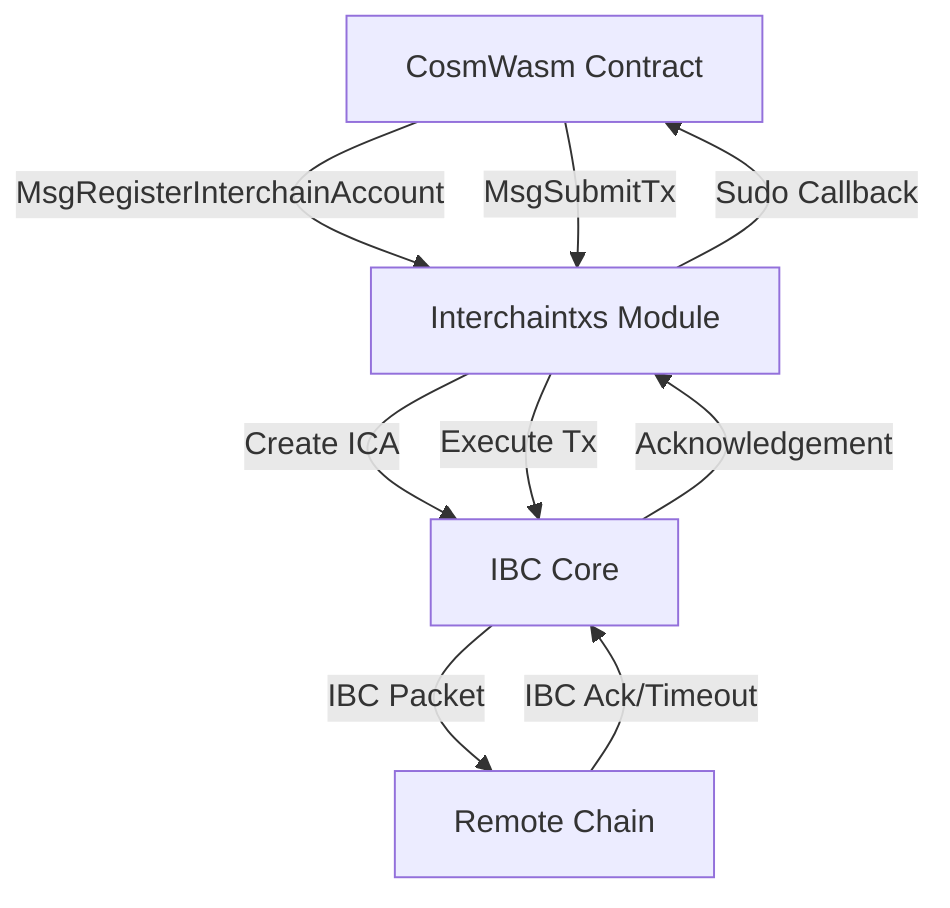
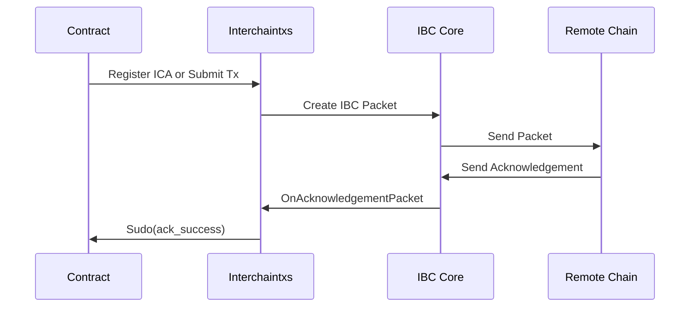
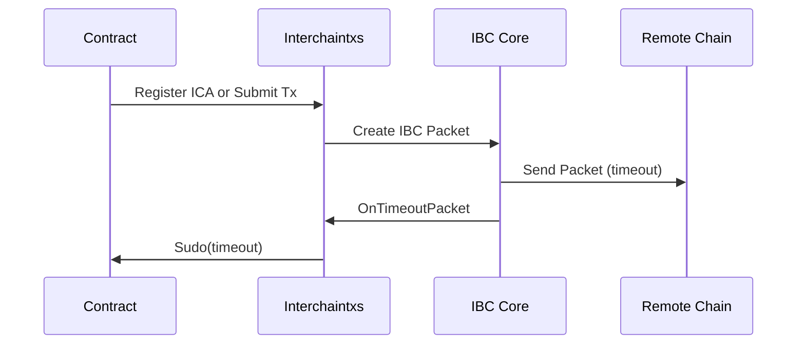
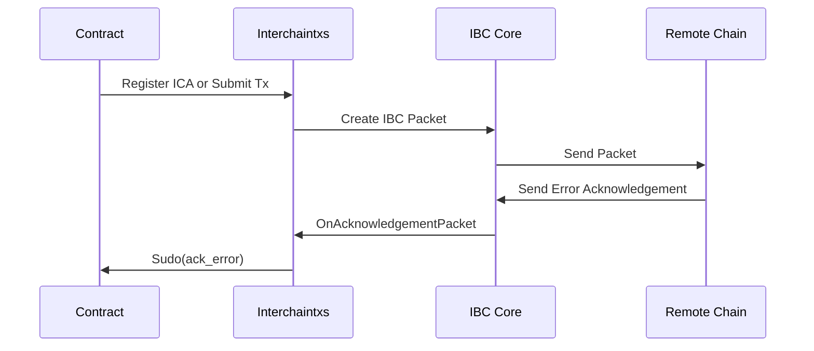

The Interchain Transactions module leverages IBC (Inter-Blockchain Communication) to enable CosmWasm smart contracts on Neutron to control accounts and execute transactions on remote chains. This document explains the key concepts and mechanics behind this functionality.

## Architecture Overview

The module operates on the principles of the IBC protocol and the Interchain Accounts (ICA) specification, with custom extensions to make these capabilities available to smart contracts.



## Interchain Account Registration

When a contract wants to interact with a remote chain, it must first register an interchain account. This process involves:

1. A contract submits a `MsgRegisterInterchainAccount` message
2. The module creates a unique port ID based on the contract address and interchain account ID
3. The module initiates IBC channel creation to the remote chain
4. Once the channel is established, an account is automatically created on the remote chain
5. The contract receives the channel ID and port ID via a callback

The port ID follows a specific format: `icacontroller-{contract_address}.{interchain_account_id}`. This ensures that each interchain account is uniquely associated with a specific contract and identifier.

## Executing Remote Transactions

Once an interchain account is registered, the contract can execute transactions on the remote chain:

1. The contract submits a `MsgSubmitTx` message containing one or more messages to execute
2. The module wraps these messages in an IBC packet and sends it to the remote chain
3. The remote chain executes the messages using the interchain account
4. The result (success or failure) is returned via an IBC acknowledgement
5. The contract receives the result via a callback

The module supports executing any valid transaction type on the remote chain, provided that the interchain account has sufficient permissions and funds.

## IBC Events and Callbacks

All interchain transactions are asynchronous, meaning the contract must be prepared to handle callbacks when the results are available:

### Successful Callback Flow



### Timeout Callback Flow



### Error Callback Flow



## Sudo Callbacks and Error Handling

The module uses the CosmWasm `Sudo` mechanism to call back into the contract when IBC events occur. Each callback follows a specific message format that the contract must implement to properly handle the events.

The Contract Manager module wraps these callbacks with error handling and gas limiting to ensure that:

1. Contract errors during callback processing don't prevent the acknowledgement from being marked as processed
2. Callbacks are limited to a specific gas amount to prevent excessive computation

## Error Reporting and Debugging

When an interchain transaction fails on the remote chain, the error information passed back to the contract is limited due to IBC protocol constraints. The error message is typically reduced to just an error code without detailed information.

To find detailed error information, you can query the packet events on the remote chain using the command:

```bash
<remote-chain-binary> q interchain-accounts host packet-events <channel-id> <seq-id>
```

Where:
- `<remote-chain-binary>` is the CLI binary for the remote chain
- `<channel-id>` is the ICA channel ID on the remote chain
- `<seq-id>` is the sequence ID of the IBC packet

## Fee Management

To ensure that relayers are incentivized to deliver IBC packets, the module requires fee payment for interchain transactions. When submitting an interchain transaction, the sender must provide:

1. A fee for packet submission
2. A fee for acknowledgement delivery
3. A fee for timeout delivery (refunded if the packet is delivered successfully)

These fees are managed by the Fee Refunder module, which ensures that relayers are compensated for their services and unused fees are returned to the sender. 