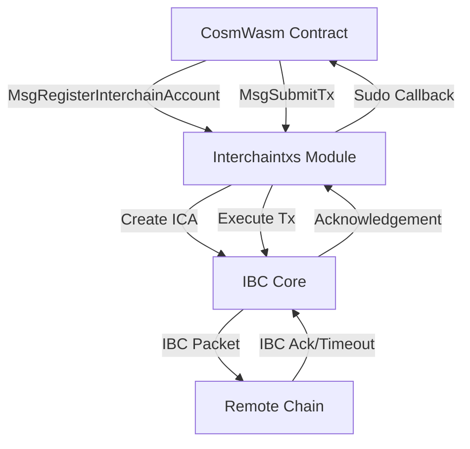
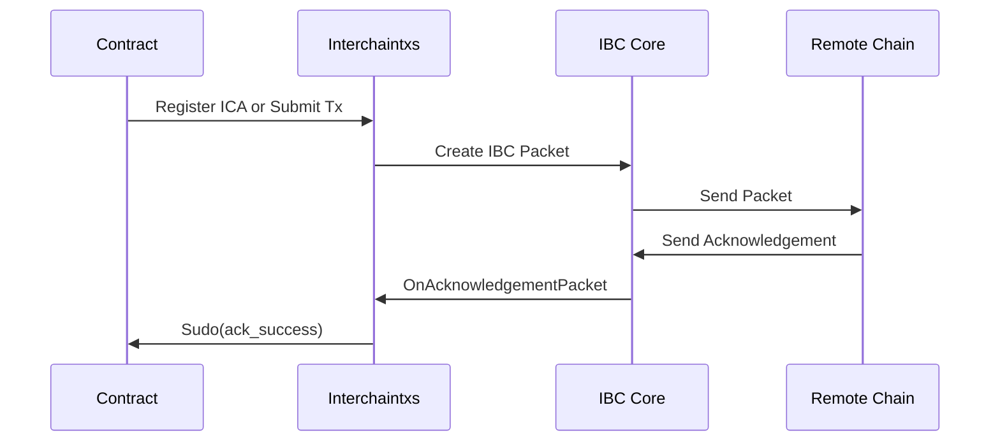
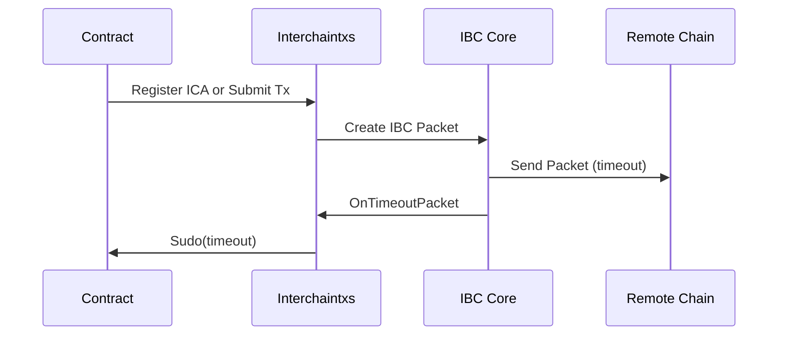
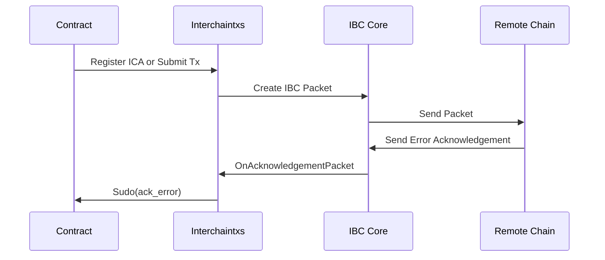

The Interchain Transactions module leverages IBC (Inter-Blockchain Communication) to enable CosmWasm smart contracts on Neutron to control accounts and execute transactions on remote chains. This document explains the key concepts and mechanics behind this functionality.

## Architecture Overview

The module operates on the principles of the IBC protocol and the Interchain Accounts (ICA) specification, with custom extensions to make these capabilities available to smart contracts.



## Interchain Account Registration

When a contract wants to interact with a remote chain, it must first register an interchain account. This process involves:

1. A contract submits a `MsgRegisterInterchainAccount` message
2. The module creates a unique port ID based on the contract address and interchain account ID
3. The module initiates IBC channel creation to the remote chain
4. Once the channel is established, an account is automatically created on the remote chain
5. The contract receives the channel ID and port ID via a callback

The port ID follows a specific format: `icacontroller-{contract_address}.{interchain_account_id}`. This ensures that each interchain account is uniquely associated with a specific contract and identifier.

## Executing Remote Transactions

Once an interchain account is registered, the contract can execute transactions on the remote chain:

1. The contract submits a `MsgSubmitTx` message containing one or more messages to execute
2. The module wraps these messages in an IBC packet and sends it to the remote chain
3. The remote chain executes the messages using the interchain account
4. The result (success or failure) is returned via an IBC acknowledgement
5. The contract receives the result via a callback

The module supports executing any valid transaction type on the remote chain, provided that the interchain account has sufficient permissions and funds.

## IBC Events and Callbacks

All interchain transactions are asynchronous, meaning the contract must be prepared to handle callbacks when the results are available:

### Successful Callback Flow



### Timeout Callback Flow



### Error Callback Flow



## Sudo Callbacks and Error Handling

The module uses the CosmWasm `Sudo` mechanism to call back into the contract when IBC events occur. Each callback follows a specific message format that the contract must implement to properly handle the events.

### Contract Manager Wrapper

All sudo callbacks are wrapped by the Contract Manager's `SudoLimitWrapper`, which provides critical protections:

```
OnAcknowledgementPacket → SudoLimitWrapper → Contract Sudo Handler
```

The wrapper serves two essential purposes:

1. **Error Suppression:** Contract errors during callback processing are suppressed and don't prevent the acknowledgement from being marked as processed. This prevents infinite resubmission loops where relayers would repeatedly try to deliver the same acknowledgement.

2. **Gas Limiting:** Callbacks are limited to a specific gas amount to prevent excessive computation that could drain relayer funds or cause timeouts.

### Critical Implementation Guidelines

<Warning>
Contract developers must write Sudo handlers very carefully and keep them as simple as possible. Complex logic should verify acknowledgement data before making state changes, allowing the handler to return `Ok()` immediately if the data is incompatible.
</Warning>

If a sudo handler fails:
- The acknowledgement is still marked as processed in the IBC module
- Relayers successfully receive fees for the delivery
- Failed callback information is stored in the Contract Manager state for potential resubmission
- No infinite retry loops occur

This design prioritizes IBC protocol reliability over individual contract error recovery.

## Channel Management and Recovery

### Channel Timeouts and Ordering

Interchain Account channels can use either ORDERED or UNORDERED ordering, with different timeout behaviors:

**ORDERED Channels:**
- A single packet timeout will close the entire channel
- When this happens:
  1. The contract receives a timeout callback for the failed packet
  2. The channel is automatically closed and cannot be reused
  3. To continue using interchain accounts, the contract must register a new account (which creates a new channel)

**UNORDERED Channels (Default since ibc-go v7.5.0):**
- Packet timeouts do not close the channel
- Individual packets can timeout without affecting the channel's ability to process other packets
- The channel remains active and can continue to be used for new transactions

<Info>
For more details about ICA channel ordering and active channel management, see the [IBC documentation on Active Channels](https://ibc.cosmos.network/v7/apps/interchain-accounts/active-channels/).
</Info>

### Best Practices

<Info>
Set packet timeouts to very large values to minimize the risk of channel closure. Channel recovery requires full re-registration of the interchain account.
</Info>

There are no dedicated events for channel closure in the ICA specification - timeout notifications serve as the signal that a channel has been closed.

## Error Reporting and Debugging

When an interchain transaction fails on the remote chain, the error information passed back to the contract is severely limited due to IBC protocol constraints. The error message is typically truncated to just an error code without detailed information to avoid nondeterminism.

### Finding Detailed Error Information

For detailed error information, you can query the packet events on the remote chain using:

```bash
<remote-chain-binary> q interchain-accounts host packet-events <channel-id> <seq-id>
```

Where:
- `<remote-chain-binary>` is the CLI binary for the remote chain (e.g., `gaiad`, `osmosisd`)
- `<channel-id>` is the ICA channel ID on the remote chain (obtained from the OpenAck callback's `counterparty_channel_id`)
- `<seq-id>` is the sequence ID returned from the `MsgSubmitTx` response

### Finding Channel Information

If you don't have the remote channel ID, you can query it using:

```bash
neutrond q ibc channel end <src-port> <src-channel-id>
```

Where:
- `<src-port>` is the port ID (format: `icacontroller-{contract_address}.{interchain_account_id}`)
- `<src-channel-id>` is the local channel ID from your registration

### Error Response Format

When errors occur, the contract receives an acknowledgement with format `codespace: <module>, code: <error_code>`. For example:

```
codespace: wasm, code: 5
```

The `codespace` indicates the module where the error occurred, and `code` is the unique error identifier. You can find error descriptions in the remote chain's source code at `x/<module>/types/errors.go`.

### IBC-Go Version Compatibility

This error debugging method requires the remote chain to run:
- ibc-go v7.2.3+, v7.3.2+, v8.0.1+, or v8.1+

Earlier versions may not provide detailed error information due to protocol limitations.

## Fee Management

To ensure that relayers are incentivized to deliver IBC packets, the module requires fee payment for interchain transactions. When submitting an interchain transaction, the sender must provide:

1. A fee for packet submission
2. A fee for acknowledgement delivery
3. A fee for timeout delivery (refunded if the packet is delivered successfully)

These fees are managed by the Fee Refunder module, which ensures that relayers are compensated for their services and unused fees are returned to the sender.

### Registration Fee Implementation

A minimum fee is required for registering interchain accounts:

- **Purpose:** Prevents spam by requiring payment to register interchain accounts  
- **Fee Collection:** Fees are sent to a configurable fee collector address
- **Threshold Mechanism:** The module includes logic to exempt contracts below a certain code ID threshold, though the specific threshold configuration depends on chain deployment

<Info>
The actual fee collection address and code ID threshold values are set during chain deployment/upgrades and may vary by network. Check your specific network's parameters for current values.
</Info>

## Port ID Format and Account Derivation

When registering an interchain account, the module generates a unique port ID using the format:

```
icacontroller-{contract_address}.{interchain_account_id}
```

For example, if contract `neutron14hj2tavq8fpesdwxxcu44rty3hh90vhujrvcmstl4zr3txmfvw9s5c2epq` registers an account with ID `hub/1`, the port becomes:

```
icacontroller-neutron14hj2tavq8fpesdwxxcu44rty3hh90vhujrvcmstl4zr3txmfvw9s5c2epq.hub/1
```

The remote interchain account address is then derived using the connection ID and port ID as a derivation key, ensuring deterministic address generation.

## Relaying Considerations

Since Neutron contracts can execute custom logic during IBC packet processing, relayers may need special configuration to avoid unexpected costs. Protocols often run dedicated relayers with packet filters.

For example, in Hermes relayer, you can restrict relaying to specific contracts:

```toml
[chains.packet_filter]
policy = 'allow'
list = [
    # Allow relaying only for channels created by a specific contract
    ['icacontroller-neutron14hj2tavq8fpesdwxxcu44rty3hh90vhujrvcmstl4zr3txmfvw9s5c2epq*', '*'],
]
```

This ensures that relayers only process packets for trusted contracts and aren't exposed to potentially expensive callback execution. 