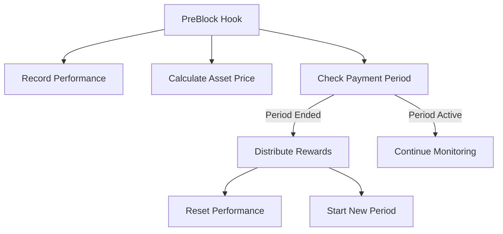
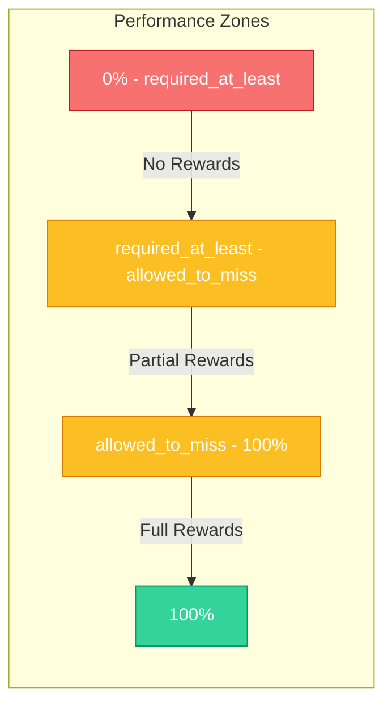

The Revenue module provides a comprehensive system for compensating validators based on their performance. This module operates alongside the traditional staking rewards, offering additional incentives tied directly to metrics that measure validator reliability and service quality.

## Rewards System Architecture

The Revenue module's primary responsibility is to assess validator performance, calculate appropriate compensation, and distribute rewards according to configurable schedules. The system leverages real-time performance data and price information to ensure fair and timely compensation.



## Performance Assessment

Validators are evaluated on two critical metrics:

1. **Block Production Participation**: The percentage of blocks signed during the payment period
2. **Oracle Price Submissions**: The percentage of oracle votes provided during the payment period

### Performance Requirements

The module uses two configurable thresholds to determine reward eligibility:

- **Required At Least**: The minimum performance required on both metrics to qualify for any rewards
- **Allowed To Miss**: The maximum percentage of misses allowed to still receive full rewards

These thresholds create three performance zones:



### Performance Rating Calculation

Performance rating determines the proportion of rewards a validator receives:

- **Full Rating (1.0)**: If performance on both metrics meets or exceeds the "allowed to miss" threshold
- **Zero Rating (0.0)**: If performance on either metric falls below the "required at least" threshold
- **Partial Rating (0.0-1.0)**: Rating calculated using a quadratic formula when performance falls between thresholds

The formula for partial rating is:

```
rating = 0.5 * ((1 - missedBlocksPerfQuo²) + (1 - missedOracleVotesPerfQuo²))
```

Where:
- `missedBlocksPerfQuo` is the proportion of blocks missed within the partial performance range
- `missedOracleVotesPerfQuo` is the proportion of oracle votes missed within the partial performance range

This quadratic approach provides a smoother penalty curve that more gently penalizes validators who miss just a few more blocks than the "allowed to miss" threshold.

## Payment Scheduling

The module supports multiple payment schedule types:

1. **Monthly**: Rewards are distributed at the beginning of each calendar month
2. **Block-Based**: Rewards are distributed after a specified number of blocks 
3. **Empty**: No rewards are distributed (used for testing or disabling payments)

The payment schedule is stored in two components:
- The **schedule type** in the module parameters (controllable by governance)
- The **schedule state** in the module's store (updated automatically)

When a payment period ends, the module:
1. Calculates each validator's performance rating
2. Determines the reward amount in the compensation asset
3. Transfers rewards to eligible validators
4. Resets performance metrics for the new period

## Price Calculation

Rewards are defined in USD terms but paid in the token specified in module parameters. To accurately convert between USD and token amounts, the module:

1. Tracks the cumulative price of the reward asset in each block
2. Calculates the Time-Weighted Average Price (TWAP) over a configurable window
3. Uses this TWAP to determine the exact token amount equivalent to the USD reward

The TWAP calculation follows:

```
TWAP_N = (CumulativePrice_now - CumulativePrice_now-N) / (Timestamp_now - Timestamp_now-N)
```

## Treasury Management

The Revenue module maintains a treasury account that holds funds for validator compensation. This treasury:

1. Receives funds through the `FundTreasury` message
2. Automatically pays validators at the end of each payment period
3. Can be managed through governance decisions

The treasury ensures there's a sustainable and dedicated source of funds for validator compensation independent of regular inflationary staking rewards. 