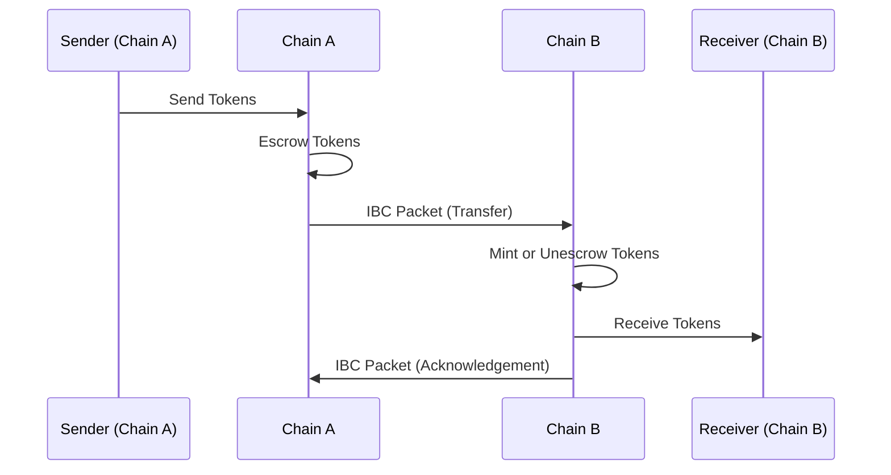
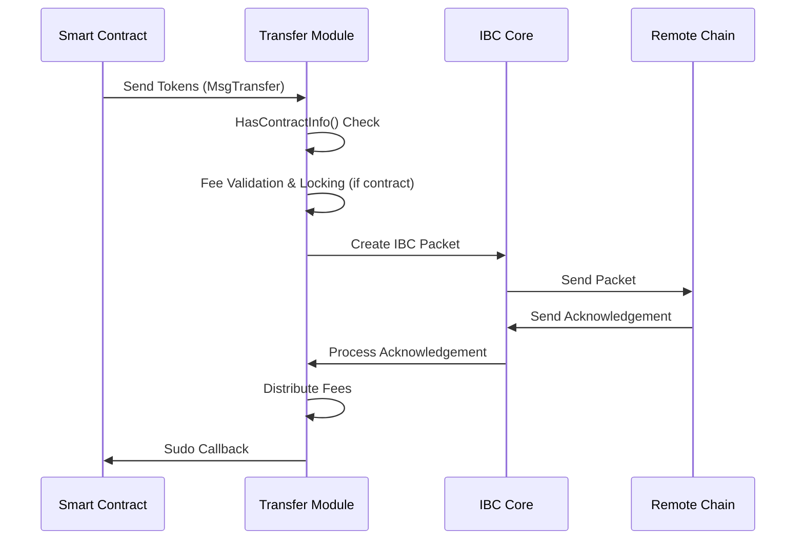
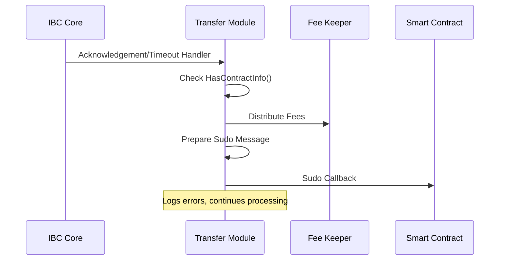
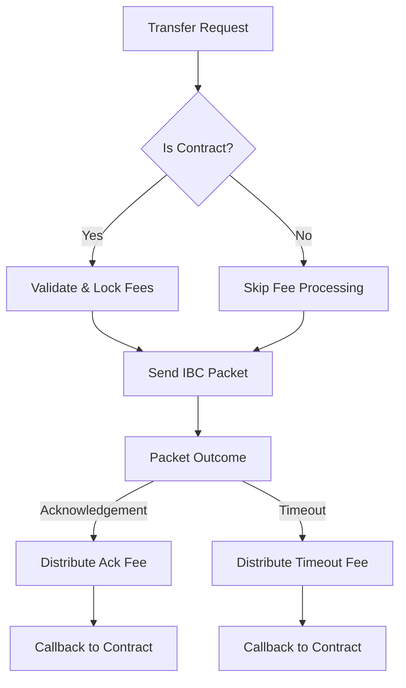

The Transfer module enables tokens to move seamlessly between IBC-connected blockchains. This document explains the concepts and mechanics of IBC token transfers and Neutron's enhancements to the standard IBC transfer protocol.

## IBC Token Transfer Basics

IBC token transfers function through a packet-relay mechanism between chains:



### Core Transfer Mechanism

1. **Token Escrow/Burn**: When a token is sent from its source chain, it is escrowed (for native tokens) or burned (for non-native tokens) on the sending chain.

2. **Packet Relay**: An IBC packet containing transfer details is sent to the destination chain.

3. **Token Release/Mint**: On the destination chain, the token is either:
   - Released from escrow (if the destination is the original source of the token)
   - Minted as an IBC voucher token (if the token is not native to the destination)

4. **Acknowledgement**: The destination chain sends back an acknowledgement to confirm receipt of the packet.

### Denomination Trace

To track the origin of tokens as they move between chains, IBC uses denomination traces:

- **Native Tokens**: When sent to another chain, native tokens (e.g., `untrn`) become prefixed with path information: `{destPort}/{destChannel}/{denom}`
- **IBC Tokens**: When received from another chain, tokens carry their full path history

Example flow:
1. `untrn` on Neutron is sent to Cosmos Hub via channel-1
2. On Cosmos Hub, it appears as `transfer/channel-X/untrn`
3. If sent back to Neutron, it reverts to its original form: `untrn`

## Neutron's Enhanced Transfer Module

Neutron extends the standard IBC transfer module with contract-focused features:

### Contract Detection and Handling

The Transfer module automatically detects contract senders and applies specific handling:



1. **Contract Detection**: The module uses `HasContractInfo(ctx, senderAddress)` to determine if the sender is a smart contract.

2. **Contract-Specific Validation**: For contract senders, the module validates fees using `msg.Fee.Validate()`.

3. **Fee Locking**: For contracts, fees are automatically locked using `FeeKeeper.LockFees()` before sending the packet.

### Enhanced Response Objects

Standard IBC transfers return minimal information. Neutron enhances this:

1. **Extended Response**: The `MsgTransferResponse` includes:
   - `sequence_id`: The IBC packet sequence number
   - `channel`: The source channel ID

2. **Traceability**: These fields enable correlation between transfer requests and their outcomes.

### Callback System

The Transfer module implements a callback system for contract senders:



1. **Callback Trigger**: When acknowledgements or timeouts are received, the module checks if the original sender was a contract.

2. **Message Preparation**: The module calls `keeper.PrepareSudoCallbackMessage()` to create the callback message.

3. **Sudo Call**: The module executes `sudoKeeper.Sudo(ctx, senderAddress, msg)` to deliver the callback.

4. **Error Handling**: Failed Sudo calls are logged but do not block IBC processing: `"HandleAcknowledgement: failed to Sudo contract on packet acknowledgement"`

## Fee Management

The Transfer module coordinates with the Fee Refunder module for packet fees:



1. **Fee Validation**: Only contracts must provide valid fees (`Validate(isContract bool)` method).

2. **Fee Locking**: Before packet transmission, contracts' fees are locked via `FeeKeeper.LockFees()`.

3. **Fee Distribution**: The module distributes fees to relayers:
   - `DistributeAcknowledgementFee()` for successful packets
   - `DistributeTimeoutFee()` for timed-out packets

## Module Architecture

The Transfer module is implemented as a wrapper around the standard IBC Transfer module:

### Wrapper Pattern

```go
type IBCModule struct {
    wrappedKeeper      wrapkeeper.KeeperTransferWrapper
    keeper             keeper.Keeper
    sudoKeeper         neutrontypes.WasmKeeper
    tokenfactoryKeeper neutrontypes.TokenfactoryKeeper
    transfer.IBCModule
}
```

### Method Overrides

The module overrides key IBC handlers:
- `OnAcknowledgementPacket()`: Adds callback processing after standard handling
- `OnTimeoutPacket()`: Adds callback processing after standard handling  
- `Transfer()`: Adds contract detection, fee locking, and enhanced response

### Standard IBC Delegation

For all other functionality (queries, denomination traces, parameters), the module delegates to the underlying standard IBC Transfer implementation.

## Error Handling and Processing

The Transfer module implements robust error handling:

1. **Sudo Call Failures**: Logged as debug messages but processing continues
2. **Fee Processing**: Happens regardless of callback success/failure
3. **IBC Processing**: Not blocked by contract callback failures

This ensures that IBC transfer functionality remains reliable even when contract callbacks fail.

<Warning>
**Contract Callback Behavior**: The specific format and content of callback messages depend on the Contract Manager module's `PrepareSudoCallbackMessage()` implementation. Contracts should refer to the Contract Manager module documentation for callback message specifications.
</Warning> 