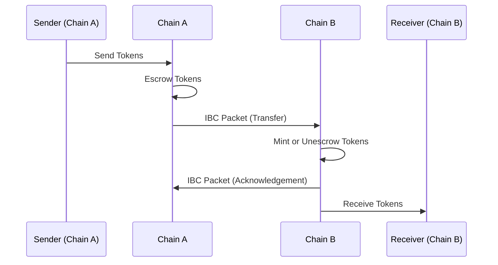
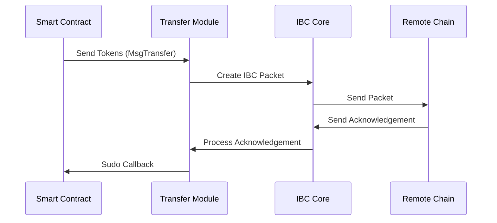
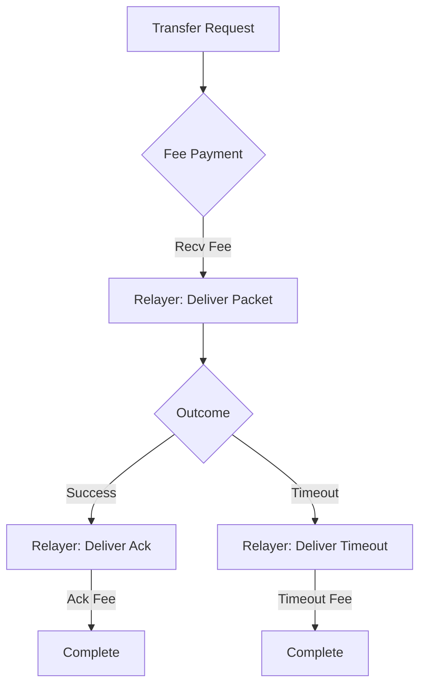

The Transfer module enables tokens to move seamlessly between IBC-connected blockchains. This document explains the concepts and mechanics of IBC token transfers and Neutron's enhancements to the standard IBC transfer protocol.

## IBC Token Transfer Basics

IBC token transfers function through a packet-relay mechanism between chains:



### Core Transfer Mechanism

1. **Token Escrow/Burn**: When a token is sent from its source chain, it is escrowed (for native tokens) or burned (for non-native tokens) on the sending chain.

2. **Packet Relay**: An IBC packet containing transfer details is sent to the destination chain.

3. **Token Release/Mint**: On the destination chain, the token is either:
   - Released from escrow (if the destination is the original source of the token)
   - Minted as an IBC voucher token (if the token is not native to the destination)

4. **Acknowledgement**: The destination chain sends back an acknowledgement to confirm receipt of the packet.

### Denomination Trace

To track the origin of tokens as they move between chains, IBC uses denomination traces:

- **Native Tokens**: When sent to another chain, native tokens (e.g., `untrn`) become prefixed with path information: `{destPort}/{destChannel}/{denom}`
- **IBC Tokens**: When received from another chain, tokens carry their full path history

Example flow:
1. `untrn` on Neutron is sent to Cosmos Hub via channel-1
2. On Cosmos Hub, it appears as `transfer/channel-X/untrn`
3. If sent back to Neutron, it reverts to its original form: `untrn`

## Neutron's Enhanced Transfer Module

Neutron extends the standard IBC transfer module with several contract-focused features:

### Contract Callback System



1. **Callback Mechanism**: Unlike the standard IBC transfer module that only emits events, Neutron's module actively calls back to the sending contract using the `Sudo` mechanism when acknowledgements or timeouts are received.

2. **Request ID Format**: For Sudo callbacks, a request ID is generated in the format `channel-{channelID}-{sequence}` (e.g., `channel-1-42`), allowing contracts to correlate responses with their original transfers.

3. **Callback Types**:
   - **Success**: When a transfer completes successfully
   - **Error**: When a transfer fails on the destination chain
   - **Timeout**: When a packet times out before being processed

### Enhanced Response Objects

Standard IBC transfers return minimal information, making it difficult for contracts to track their transfers. Neutron addresses this by:

1. **Extended Response**: The `MsgTransferResponse` includes:
   - `sequence_id`: The IBC packet sequence number
   - `channel`: The source channel ID

2. **Traceability**: These fields allow contracts to store and track pending transfers until their callbacks are received.

## Fee Management

Token transfers require relayers to deliver packets between chains. Neutron manages this with a comprehensive fee system:



1. **Fee Structure**:
   - `recv_fee`: Paid for delivering the packet to the destination
   - `ack_fee`: Paid for delivering the acknowledgement back to Neutron
   - `timeout_fee`: Paid for delivering a timeout if the packet isn't processed in time

2. **Automatic Distribution**: The Transfer module automatically coordinates with the Fee Refunder module to distribute fees to relayers based on the packet's outcome.

## TokenFactory Integration

To ensure proper token management, Neutron's Transfer module registers IBC escrow addresses with the TokenFactory module when channels are created:

1. **Escrow Address Registration**: During channel creation (`OnChanOpenAck` and `OnChanOpenConfirm`), the escrow address for the channel is registered with the TokenFactory module.

2. **Purpose**: This integration ensures that TokenFactory correctly tracks and manages tokens that have entered or left Neutron via IBC channels.

## Contract Callback Processing

When the Transfer module calls back to a sending contract:

1. **Gas Limitation**: The Sudo callback is executed with a limited amount of gas to prevent excessive computation.

2. **Error Handling**: Errors in the contract's callback handler are suppressed by the Contract Manager middleware, ensuring IBC packet processing completes even if the contract callback fails.

3. **Error Logging**: Failed callbacks are logged but don't block the IBC protocol flow.

## Timeout and Error Recovery

If a transfer fails or times out:

1. **Automatic Refund**: Native tokens are automatically released from escrow on the source chain.

2. **Contract Notification**: The sending contract is notified of the failure or timeout via a Sudo callback.

3. **Recovery Flow**:
   ```mermaid
   sequenceDiagram
       participant Contract as Smart Contract
       participant Transfer as Transfer Module
       participant IBC as IBC Core
       
       IBC->>Transfer: Timeout/Error Notification
       Transfer->>Contract: Sudo Callback (Timeout/Error)
       Transfer->>IBC: Complete Packet Processing
   ```

By extending the base IBC transfer functionality with contract-centric features, Neutron enables a more seamless and reliable experience for smart contracts working with cross-chain token transfers. 