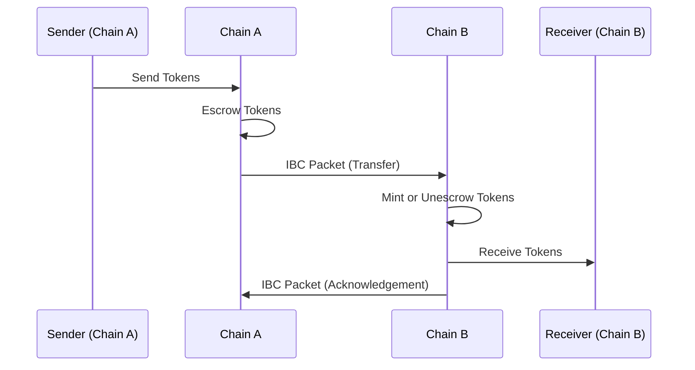
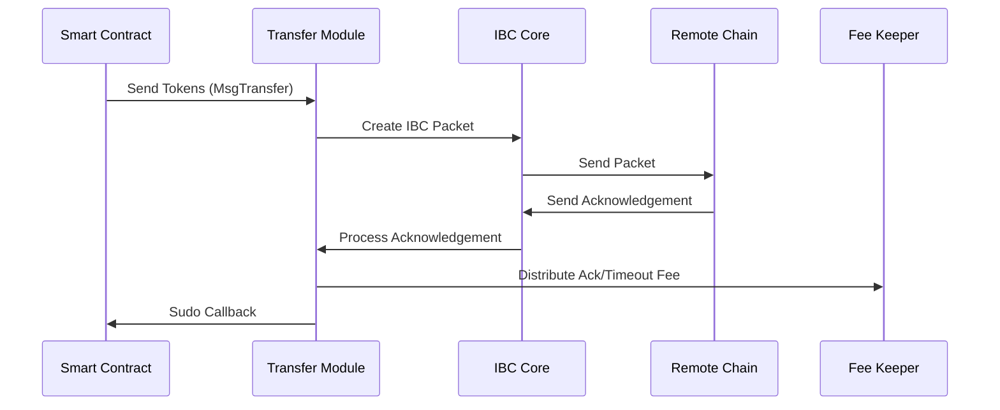
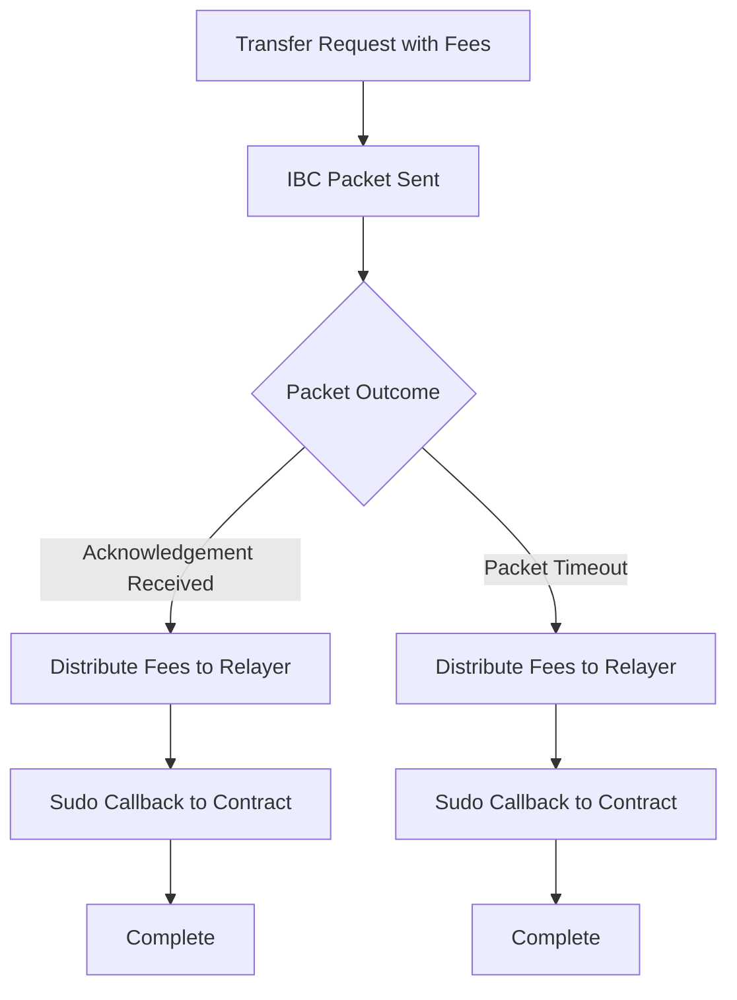

The Transfer module enables tokens to move seamlessly between IBC-connected blockchains. This document explains the concepts and mechanics of IBC token transfers and Neutron's enhancements to the standard IBC transfer protocol.

## IBC Token Transfer Basics

IBC token transfers function through a packet-relay mechanism between chains:



### Core Transfer Mechanism

1. **Token Escrow/Burn**: When a token is sent from its source chain, it is escrowed (for native tokens) or burned (for non-native tokens) on the sending chain.

2. **Packet Relay**: An IBC packet containing transfer details is sent to the destination chain.

3. **Token Release/Mint**: On the destination chain, the token is either:
   - Released from escrow (if the destination is the original source of the token)
   - Minted as an IBC voucher token (if the token is not native to the destination)

4. **Acknowledgement**: The destination chain sends back an acknowledgement to confirm receipt of the packet.

### Denomination Trace

To track the origin of tokens as they move between chains, IBC uses denomination traces:

- **Native Tokens**: When sent to another chain, native tokens (e.g., `untrn`) become prefixed with path information: `{destPort}/{destChannel}/{denom}`
- **IBC Tokens**: When received from another chain, tokens carry their full path history

Example flow:
1. `untrn` on Neutron is sent to Cosmos Hub via channel-1
2. On Cosmos Hub, it appears as `transfer/channel-X/untrn`
3. If sent back to Neutron, it reverts to its original form: `untrn`

## Neutron's Enhanced Transfer Module

Neutron extends the standard IBC transfer module with several contract-focused features:

### Contract Callback System



1. **Callback Mechanism**: Unlike the standard IBC transfer module that only emits events, Neutron's module actively calls back to the sending contract using the `Sudo` mechanism when acknowledgements or timeouts are received.

2. **Callback Format**: The specific callback message format and request ID structure are defined by the Contract Manager module through the `PrepareSudoCallbackMessage` function.

3. **Callback Types**: The Transfer module handles different packet outcomes by calling the appropriate callback mechanisms for success, error, and timeout scenarios.

### Enhanced Response Objects

Standard IBC transfers return minimal information, making it difficult for contracts to track their transfers. Neutron addresses this by:

1. **Extended Response**: The `MsgTransferResponse` includes:
   - `sequence_id`: The IBC packet sequence number
   - `channel`: The source channel ID

2. **Traceability**: These fields allow contracts to store and track pending transfers until their callbacks are received.

## Fee Management

Token transfers require relayers to deliver packets between chains. Neutron manages this with a comprehensive fee system:



1. **Fee Structure**: The fee structure is defined by the `neutron.feerefunder.Fee` type and managed by the Fee Refunder module.

2. **Contract-Only Requirement**: The Transfer module validates fees only for contract senders (as seen in the `Validate(isContract bool)` method).

3. **Automatic Distribution**: The Transfer module coordinates with the Fee Refunder module to distribute fees to relayers:
   - `DistributeAcknowledgementFee()` called on packet acknowledgement
   - `DistributeTimeoutFee()` called on packet timeout

## Contract Callback Processing

When the Transfer module calls back to a sending contract:

1. **Sudo Call**: The Transfer module calls `sudoKeeper.Sudo(ctx, senderAddress, msg)` to deliver the callback to the contract.

2. **Callback Message**: The callback message is prepared by the Contract Manager module via `PrepareSudoCallbackMessage()`.

3. **Non-blocking**: The Transfer module logs any errors from the Sudo call but continues processing regardless of the outcome.

## Timeout and Error Recovery

If a transfer fails or times out:

1. **IBC Protocol Handling**: Standard IBC protocol handles token refunds and state cleanup.

2. **Contract Notification**: The sending contract is notified of the failure or timeout via a Sudo callback.

3. **Recovery Flow**:
   ```mermaid
   sequenceDiagram
       participant IBC as IBC Core
       participant Transfer as Transfer Module
       participant FeeKeeper as Fee Keeper
       participant Contract as Smart Contract
       
       IBC->>Transfer: Timeout/Error Handler
       Transfer->>FeeKeeper: Distribute Timeout/Error Fee
       Transfer->>Contract: Sudo Callback (Timeout/Error)
       Note over Transfer: Handler completes, IBC processing done
   ```

By extending the base IBC transfer functionality with contract-centric features, Neutron enables a more seamless and reliable experience for smart contracts working with cross-chain token transfers. 