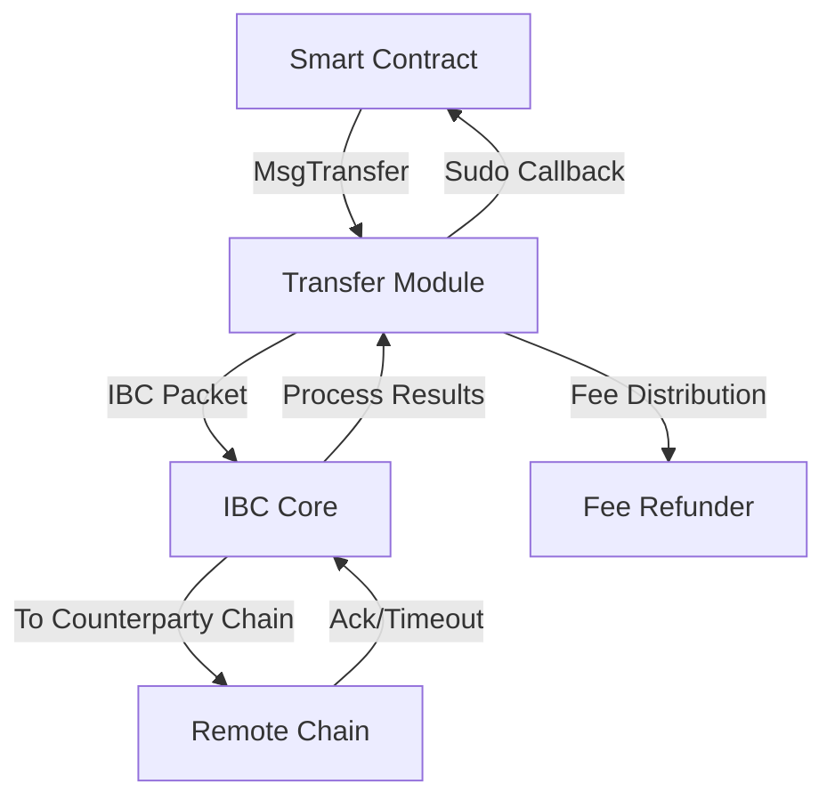

The Transfer module in Neutron is an enhanced wrapper around the standard IBC Transfer module that facilitates token transfers between IBC-connected blockchains. It extends the core functionality with contract-centric features that improve the developer experience when working with interchain token transfers.

## Key Features

<CardGroup cols={2}>
  <Card title="Contract Callbacks" icon="reply">
    Returns IBC transfer results directly to the sending contract via Sudo calls, enabling contracts to process acknowledgements and timeouts.
  </Card>
  <Card title="Enhanced Responses" icon="circle-info">
    Provides informative responses with sequence IDs and channel information to help contracts track their interchain transfers.
  </Card>
  <Card title="Fee Management" icon="money-bill-transfer">
    Integrates with the Fee Refunder module to distribute fees for IBC packet acknowledgements and timeouts.
  </Card>
  <Card title="IBC Compatibility" icon="link">
    Maintains full compatibility with standard IBC Transfer functionality while adding smart contract enhancements.
  </Card>
</CardGroup>

## Module Interactions

The Transfer module interacts with several other modules in the Neutron ecosystem:

- **IBC Core**: Routes packets between chains using the IBC protocol
- **Contract Manager**: The transfer module imports and uses `contractmanager/keeper` for callback message preparation
- **Fee Refunder**: The transfer module imports and uses `feerefunder/types` for fee handling

## Architecture

The Transfer module encapsulates the standard IBC transfer functionality while adding contract-friendly features. It extends the base IBC Transfer module to enable smart contracts to reliably work with cross-chain token transfers.

## Standard IBC Transfer Features

The module maintains all capabilities of the standard IBC Transfer module, including:

- Transfer of tokens between IBC-connected chains
- Denomination trace for cross-chain tokens
- Automatic escrowing and releasing of tokens
- Support for transfer timeout and recovery

For more details on the core IBC Transfer functionality, see the [IBC Transfer documentation](https://ibc.cosmos.network/main/apps/transfer/overview.html).

## Learn More

<CardGroup cols={2}>
  <Card title="How Interchain Transfers Work" icon="book" href="/developers/modules/transfer/how-to">
    Learn how to implement interchain token transfers in your contracts
  </Card>
  <Card title="Technical Reference" icon="file-code" href="/developers/modules/transfer/reference">
    View technical specifications and message formats
  </Card>
</CardGroup> 