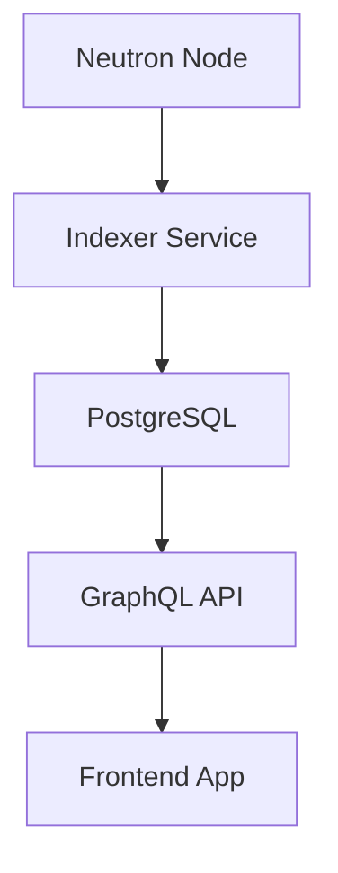
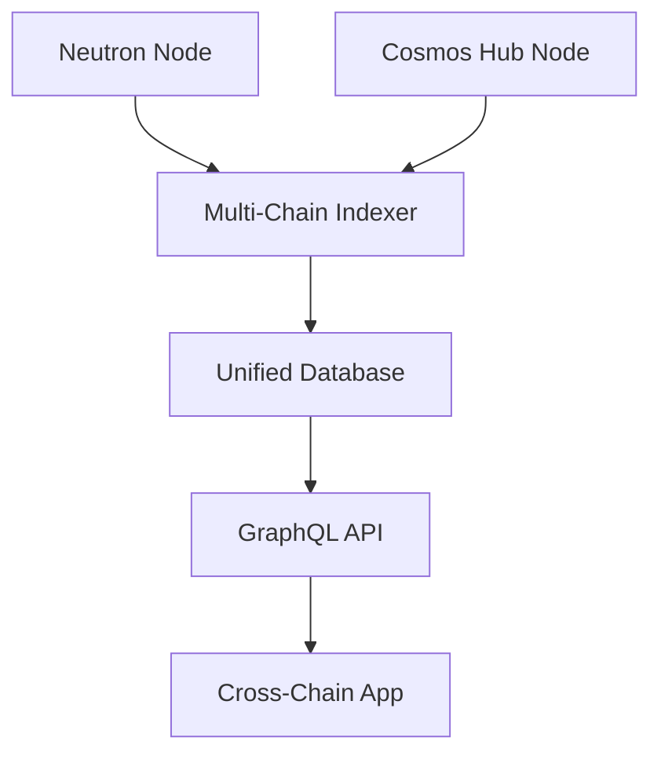
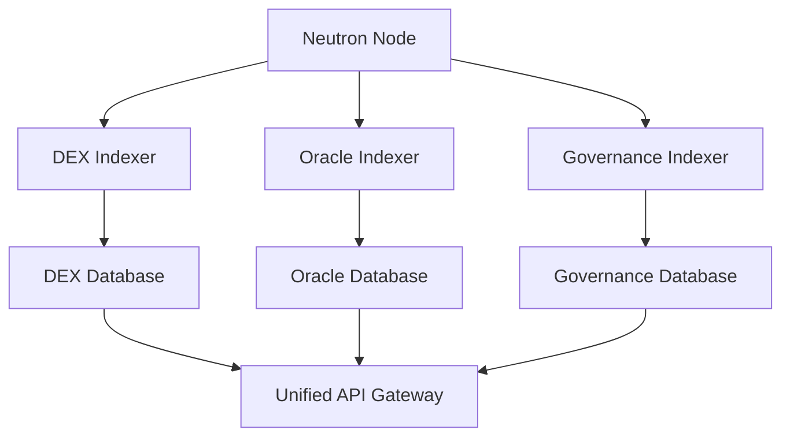

Blockchains are optimized for consensus and security, not for complex queries. Indexers solve this by extracting blockchain data into optimized databases that enable fast, flexible queries for applications and analytics.

## What Are Indexers?

Indexers are specialized services that:
- **Extract** data from blockchain nodes as blocks are produced
- **Transform** raw blockchain data into structured, queryable formats  
- **Store** processed data in optimized databases (typically PostgreSQL)
- **Provide** APIs (usually GraphQL or REST) for applications to query data

## Why Do You Need Indexers?

### Blockchain Query Limitations

<CardGroup cols={2}>
  <Card title="Slow Queries" icon="clock">
    Direct blockchain queries are slow and resource-intensive
  </Card>
  <Card title="Limited Functionality" icon="ban">
    Blockchains don't support complex queries, joins, or aggregations
  </Card>
  <Card title="Historical Data" icon="calendar">
    Accessing historical data requires scanning many blocks
  </Card>
  <Card title="Real-time Updates" icon="bolt">
    Getting live updates requires constant polling
  </Card>
</CardGroup>

### Indexer Benefits

<CardGroup cols={2}>
  <Card title="Fast Queries" icon="rocket">
    Millisecond response times for complex queries
  </Card>
  <Card title="Rich Functionality" icon="database">
    SQL queries, joins, aggregations, and filtering
  </Card>
  <Card title="Real-time Subscriptions" icon="satellite-dish">
    WebSocket subscriptions for live data updates
  </Card>
  <Card title="Application Performance" icon="chart-line">
    Dramatically improve user experience
  </Card>
</CardGroup>

## Common Use Cases

### 1. DeFi Applications

```graphql
# Query user's liquidity positions across multiple pools
query UserPositions($userAddress: String!) {
  liquidityPositions(where: { user: $userAddress }) {
    id
    pool {
      token0 { symbol }
      token1 { symbol }
    }
    liquidity
    token0Amount
    token1Amount
    createdAt
  }
}
```

### 2. Portfolio Tracking

```graphql
# Get user's transaction history with token prices
query UserTransactions($userAddress: String!) {
  transactions(
    where: { user: $userAddress }
    orderBy: timestamp
    orderDirection: desc
  ) {
    hash
    type
    tokens {
      symbol
      amount
      priceUSD
    }
    timestamp
  }
}
```

### 3. Analytics Dashboards

```graphql
# Get daily trading volume for the last 30 days
query TradingVolume {
  dailyStats(
    first: 30
    orderBy: date
    orderDirection: desc
  ) {
    date
    volumeUSD
    txCount
    uniqueUsers
  }
}
```

## Neutron-Specific Data

Neutron's unique modules generate special data that indexers can capture:

### Oracle Price Data

```javascript
// Index oracle price updates
const oraclePrices = await api.query(
  `query {
    oraclePriceUpdates(
      where: { denom: "ATOM" }
      orderBy: blockHeight
      orderDirection: desc
      first: 100
    ) {
      blockHeight
      denom
      price
      timestamp
      validator
    }
  }`
);
```

### Interchain Query Results

```javascript
// Track ICQ query results
const icqResults = await api.query(
  `query {
    interchainQueries {
      id
      connectionId
      queryType
      results(orderBy: timestamp, orderDirection: desc) {
        data
        timestamp
        blockHeight
      }
    }
  }`
);
```

### Cron Job Executions

```javascript
// Monitor automated cron executions
const cronExecutions = await api.query(
  `query {
    cronExecutions(first: 50) {
      scheduleName
      executedAt
      success
      gasUsed
      contract
      message
    }
  }`
);
```

## Architecture Patterns

### 1. Single Indexer



**Best for:** Small to medium applications with specific data needs

### 2. Multi-Chain Indexing



**Best for:** Applications requiring data from multiple blockchains

### 3. Microservice Architecture



**Best for:** Large applications with complex, domain-specific requirements

## Data Models

### Core Entities

Most Neutron indexers track these fundamental entities:

```typescript
interface Block {
  height: number;
  hash: string;
  timestamp: Date;
  proposer: string;
  txCount: number;
}

interface Transaction {
  hash: string;
  block: Block;
  sender: string;
  gasUsed: number;
  gasWanted: number;
  success: boolean;
  messages: Message[];
}

interface Message {
  type: string;
  data: any;
  events: Event[];
}

interface Event {
  type: string;
  attributes: Attribute[];
}

interface Attribute {
  key: string;
  value: string;
}
```

### Neutron-Specific Entities

```typescript
interface OraclePriceUpdate {
  denom: string;
  price: string;
  timestamp: Date;
  validator: string;
  blockHeight: number;
}

interface InterchainQuery {
  id: number;
  connectionId: string;
  queryType: string;
  keys: string[];
  updatePeriod: number;
  lastExecutedHeight: number;
}

interface CronSchedule {
  name: string;
  period: number;
  contract: string;
  msgs: any[];
  createdAt: Date;
  lastExecuted?: Date;
}
```

## Performance Considerations

### 1. Database Optimization

```sql
-- Essential indexes for fast queries
CREATE INDEX idx_transactions_sender ON transactions(sender);
CREATE INDEX idx_transactions_block_height ON transactions(block_height);
CREATE INDEX idx_events_type ON events(type);
CREATE INDEX idx_oracle_prices_denom_timestamp ON oracle_prices(denom, timestamp DESC);
```

### 2. Caching Strategy

```javascript
// Redis caching for frequently accessed data
const getCachedUserBalance = async (address) => {
  const cacheKey = `balance:${address}`;
  let balance = await redis.get(cacheKey);
  
  if (!balance) {
    balance = await database.getUserBalance(address);
    await redis.setex(cacheKey, 300, JSON.stringify(balance)); // 5min cache
  }
  
  return JSON.parse(balance);
};
```

### 3. Real-time Updates

```javascript
// WebSocket subscriptions for live data
const subscription = api.subscribe(`
  subscription {
    newTransactions(where: { user: "${userAddress}" }) {
      hash
      type
      amount
      timestamp
    }
  }
`);

subscription.on('data', (newTransaction) => {
  updateUI(newTransaction);
});
```

## Popular Indexing Solutions

### SubQuery
- **Best for:** Cosmos ecosystem applications
- **Features:** GraphQL API, multi-chain support, hosted service
- **Tutorial:** [SubQuery for Neutron](/developers/tutorials/indexers/subquery)

### The Graph
- **Best for:** Ethereum-compatible chains
- **Features:** Decentralized network, bounty system, mature ecosystem
- **Limitation:** Limited Cosmos support

### Custom Solutions
- **Best for:** Specific requirements, full control
- **Technologies:** Node.js, Go, Rust + PostgreSQL + GraphQL
- **Effort:** High development time but maximum flexibility

## Getting Started

1. **Identify Your Data Needs**
   - What entities do you need to track?
   - What queries will your application make?
   - How real-time do updates need to be?

2. **Choose Your Technology**
   - SubQuery for rapid development
   - Custom solution for specific needs
   - Consider multi-chain requirements

3. **Design Your Schema**
   - Map blockchain events to database entities
   - Plan for query performance
   - Consider data relationships

4. **Implement and Deploy**
   - Start with basic entities
   - Add complex relationships
   - Optimize performance iteratively

## Next Steps

<CardGroup cols={2}>
  <Card title="SubQuery Tutorial" icon="magnifying-glass-chart" href="/developers/tutorials/indexers/subquery">
    Learn to build a Neutron indexer with SubQuery
  </Card>
  <Card title="Custom Indexer Guide" icon="code" href="/developers/tutorials/indexers/custom">
    Build a custom indexer from scratch
  </Card>
</CardGroup>

## Best Practices

1. **Start Simple**: Begin with basic data and add complexity gradually
2. **Plan for Scale**: Design your schema and queries for growth
3. **Monitor Performance**: Track query performance and database metrics
4. **Handle Reorgs**: Plan for blockchain reorganizations and rollbacks
5. **Backup Data**: Implement robust backup and recovery procedures

Indexers are crucial infrastructure for modern blockchain applications. They transform slow, limited blockchain queries into fast, flexible data access that powers great user experiences. 